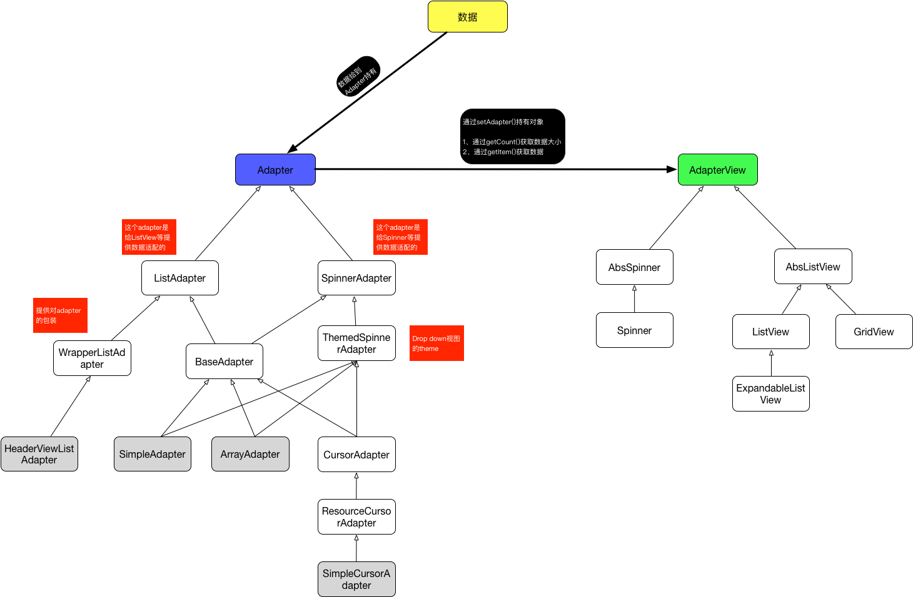
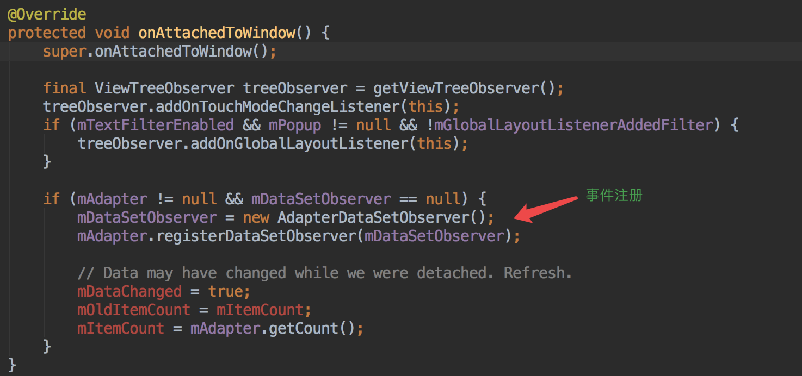
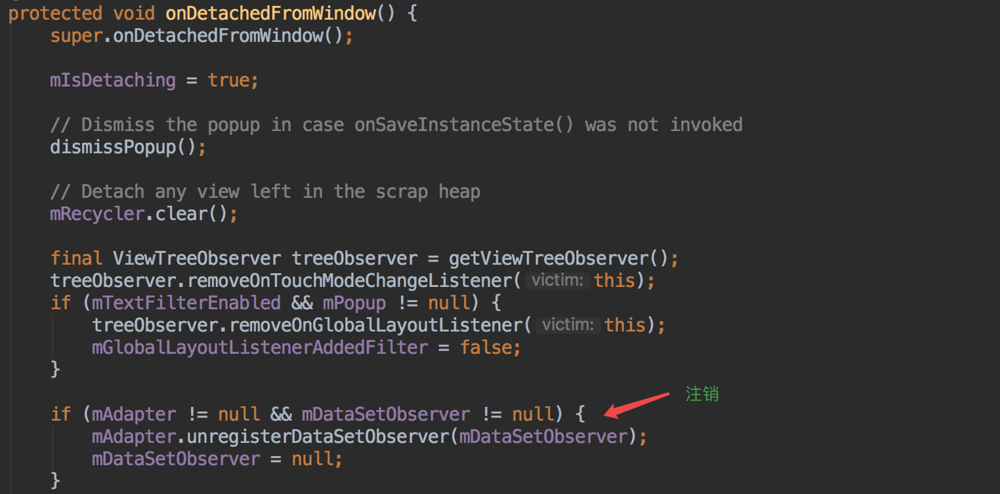
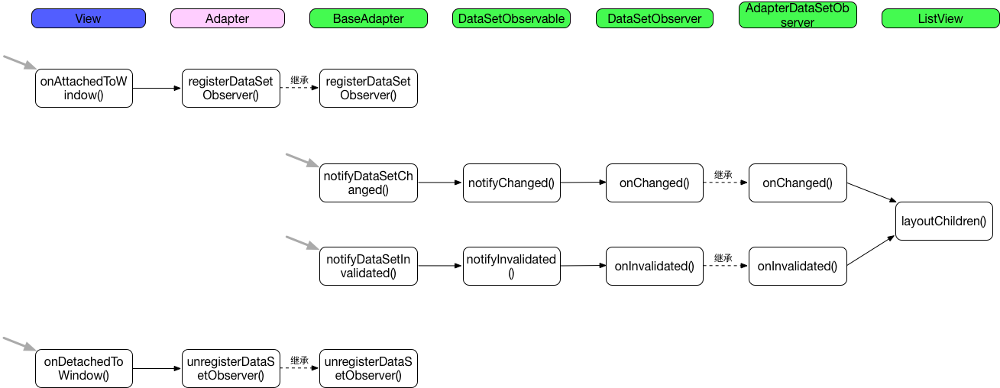
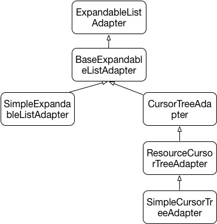

# Adapter体系的系统分析

`Adapter`是作为`AdapterView`和`数据`之间的桥梁，如下图来描述：



## Adapter类

数据适配器，对应的是设计模式的**适配器模式**。

### stableIds

```java
boolean hasStableIds();
```

这个方法一般跟另外一个方法配合使用：

```java
long getItemId(int position);
```

这2个的配合是为了实现ListView的局部刷新。

### notifyDataSetChanged

`notifyDataSetChanged`的原理是啥呢？其实就是观察者的模式。

> 被观察者

在`BaseAdapter`类中定义：

```java
private final DataSetObservable mDataSetObservable = new DataSetObservable();

// 操作...
public void registerDataSetObserver(DataSetObserver observer) {
    mDataSetObservable.registerObserver(observer);
}

public void unregisterDataSetObserver(DataSetObserver observer) {
    mDataSetObservable.unregisterObserver(observer);
}
    
public void notifyDataSetChanged() {
    mDataSetObservable.notifyChanged();
}
    
public void notifyDataSetInvalidated() {
    mDataSetObservable.notifyInvalidated();
}
```

再来看下`DataSetObservable`的代码：

```java
public class DataSetObservable extends Observable<DataSetObserver> {
    
    public void notifyChanged() {
        synchronized(mObservers) {
            for (int i = mObservers.size() - 1; i >= 0; i--) {
                mObservers.get(i).onChanged();
            }
        }
    }

    public void notifyInvalidated() {
        synchronized (mObservers) {
            for (int i = mObservers.size() - 1; i >= 0; i--) {
                mObservers.get(i).onInvalidated();
            }
        }
    }
}
```

> 观察者

`DataSetObserver`是观察者的定义。

```java
public abstract class DataSetObserver {
    /**
     * This method is called when the entire data set has changed,
     * most likely through a call to {@link Cursor#requery()} on a {@link Cursor}.
     */
    public void onChanged() {
        // Do nothing
    }

    /**
     * This method is called when the entire data becomes invalid,
     * most likely through a call to {@link Cursor#deactivate()} or {@link Cursor#close()} on a
     * {@link Cursor}.
     */
    public void onInvalidated() {
        // Do nothing
    }
}
```

它的具体实现是在`AdapterView`类里：

```java
class AdapterDataSetObserver extends DataSetObserver {

    @Override
    public void onChanged() {
    	  ... ...
        checkFocus();
        requestLayout();
    }

    @Override
    public void onInvalidated() {
        ... ...
        checkFocus();
        requestLayout();
    }
}
```

可以看出，主要是触发layout，从而触发到`layoutChildren()`。

> 何时注册和注销的呢？





综上，我们可以梳理出比较完善的流程图：



### SimpleAdapter

```java
List<Map<String, Object>> listItems = new ArrayList<Map<String, Object>>();
for (int i = 0; i < names.length; i++) {
     Map<String, Object> item = new HashMap<String, Object>();
     item.put("header", imageIds[i]);
     item.put("personname", names[i]);
     item.put("desc", descs[i]);
     listItems.add(item);
}
SimpleAdapter simpleAdapter = new SimpleAdapter(this, listItems,R.layout.frag, new String[] { "header", "personname", "desc" },new int[] { R.id.header, R.id.name, R.id.desc });
list=(ListView)findViewById(R.id.mylist);
list.setAdapter(simpleAdapter);
```

它的实现主要是：

```java
public View getView(int position, View convertView, ViewGroup parent) {
    return createViewFromResource(mInflater, position, convertView, parent, mResource);
}

private View createViewFromResource(LayoutInflater inflater, int position, View convertView,
        ViewGroup parent, int resource) {
    View v;
    if (convertView == null) {
        v = inflater.inflate(resource, parent, false);
    } else {
        v = convertView;
    }

    bindView(position, v);

    return v;
}
```

可以看到就是最简单的View复用，大家可以进入到`bindView()`方法里看到，都没有做`findViewById`优化。

> ViewBinder

这个是对上面`bindView()`逻辑的拦截，个人觉得它有2种最基本的用途：

* **提供额外的操作。比如item项的额外处理，如颜色改变。**
* **特殊化的处理，而不是走通用的逻辑。比如是通用逻辑只会处理TextView和ImageView，如果要处理Button等其他控件，我们可以用这个来特殊化的操作。**

```java
public void setViewBinder(ViewBinder viewBinder) {
    mViewBinder = viewBinder;
}

// 定义
public static interface ViewBinder {
   // view：被绑定数据的view
   // data：item的数据
   // textRepresentation：data的toString()值
   // return true不走通用流程；false还是走通用流程
	boolean setViewValue(View view, Object data, String textRepresentation);
}
```

### ArrayAdapter

```java
// resource：item的布局文件
// textViewResourceId：item里的TextView的id（只接受textview）
// objects：数据

public ArrayAdapter(@NonNull Context context, @LayoutRes int resource) {
    this(context, resource, 0, new ArrayList<>());
}

public ArrayAdapter(@NonNull Context context, @LayoutRes int resource,
        @IdRes int textViewResourceId) {
    this(context, resource, textViewResourceId, new ArrayList<>());
}
    
public ArrayAdapter(@NonNull Context context, @LayoutRes int resource, @NonNull T[] objects) {
    this(context, resource, 0, Arrays.asList(objects));
}
    
public ArrayAdapter(@NonNull Context context, @LayoutRes int resource,
        @IdRes int textViewResourceId, @NonNull T[] objects) {
    this(context, resource, textViewResourceId, Arrays.asList(objects));
}
    
public ArrayAdapter(@NonNull Context context, @LayoutRes int resource,
        @NonNull List<T> objects) {
    this(context, resource, 0, objects);
}
```

例子：

```java
ArrayAdapter adapter = new ArrayAdapter<>(this, R.layout.l, R.id.tv, datas);
listView.setAdapter(adapter);
```

### 补充阅读：Filterable

上面的`SimpleAdapter`和`ArrayAdapter`都继承了`Filterable`类，它是为了得到`Filter`类：

```java
public interface Filterable {
	Filter getFilter();
}
```

而`Filter`类是抽象类，子类需要实现：

```java
// 执行过滤逻辑
protected FilterResults performFiltering(CharSequence prefix)
// 返回过滤后的数据集
protected void publishResults(CharSequence constraint, FilterResults results)
```

其实`Filter`的内部逻辑很简单，就是起了一个线程去做数据过滤的事情，然后通过Handler将过滤后的数据返回给主线程。

具体的使用：

```java
adapter.getFilter().filter("test1", new Filter.FilterListener() {
    @Override
    public void onFilterComplete(int count) {
    	... ...
    }
});
```

### SimpleCursorAdapter

支持Cursor数据的Adapter。

```java
Cursor c = getContentResolver().query(ContactsContract.Contacts.CONTENT_URI,null, null, null, null);
String[] from = new String[]{Contacts.DISPLAY_NAME_PRIMARY};
int[] to = new int[]{R.id.contact_item};
SimpleCursorAdapter adapter = new SimpleCursorAdapter(this, R.layout.contact_item, c, from, to);
```

### HeaderViewListAdapter

支持带header和footer的ListView的适配器。**PS：这个adapter不是继承自BaseAdapter的，所以没有BaseAdapter的一些方法。**

这个类是作为`ListView`系统类使用，应用app无法直接使用。

`ListView`里的使用是通过`addHeaderView()`或`addFooterView()`方法来做到的。具体情况源码。

## AdapterView类

注意下`setAdapter()`方法：

```java
public abstract void setAdapter(T adapter);
```

这个方法具体细节不说，主要是调用`requestLayout()`方法来触发绘制。这个其实和上面说的`notifyDataSetChanged()`和`notifyDataSetInvalidated()`效果是一样的。

### ExpandableListView

这个是支持二级菜单的ListView。`ExpandableListView`的适配器不是前面说的基于`Adapter`的子类，而是基于`ExpandableListAdapter`的适配器。



具体的使用可以参考：[https://www.journaldev.com/9942/android-expandablelistview-example-tutorial](https://www.journaldev.com/9942/android-expandablelistview-example-tutorial)