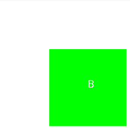

# Canvas.clipRect优化绘制

`Canvas.clipRect()`方法可以用来控制自定义控件的过度绘制，即只绘制控件中我们实际需要的部分，如有视图重叠的情况。

## 使用例子

我们通过一个绘制重叠ImageView的方式来说明这个方法锁带来的优势。我们连续的绘制3张图：

> 不做处理，直接绘制

```java
/**
 * Created by panda on 2018/7/26
 **/
public class OverdrawDemo extends View {
    private Bitmap[] mCards = new Bitmap[3];
    private int[] mIngId = new int[]{R.mipmap.guide_pic, R.mipmap.guide_pic, R.mipmap.guide_pic};

    public OverdrawDemo(Context context) {
        super(context);
        initBitmap();
    }

    private void initBitmap() {
        Bitmap bitmap = null;
        for (int i = 0; i < mCards.length; i++) {
            bitmap = BitmapFactory.decodeResource(getResources(), mIngId[i]);
            mCards[i] = Bitmap.createScaledBitmap(bitmap, 300, 800, false);
            mCards[i] = bitmap;
        }
        setBackgroundColor(0xffffffff);
    }

    @Override
    protected void onDraw(Canvas canvas) {
        super.onDraw(canvas);

        for (int i = 0; i < mCards.length; i++) {
            if (i != 0){
                canvas.translate(120, 0);
            }
            canvas.drawBitmap(mCards[i], 0, 0, null);
        }
    }
}
```

效果：


> 通过Canvas.clipRect()优化

```java
/**
 * Created by panda on 2018/7/26
 **/
public class OverdrawDemo extends View {
    private Bitmap[] mCards = new Bitmap[3];
    private int[] mIngId = new int[]{R.mipmap.guide_pic, R.mipmap.guide_pic, R.mipmap.guide_pic};

    public OverdrawDemo(Context context) {
        super(context);
        initBitmap();
    }

    private void initBitmap() {
        Bitmap bitmap = null;
        for (int i = 0; i < mCards.length; i++) {
            bitmap = BitmapFactory.decodeResource(getResources(), mIngId[i]);
            mCards[i] = Bitmap.createScaledBitmap(bitmap, 300, 800, false);
            mCards[i] = bitmap;
        }
        setBackgroundColor(0xffffffff);
    }

    @Override
    protected void onDraw(Canvas canvas) {
        super.onDraw(canvas);

        for (int i = 0; i < mCards.length; i++) {
            if (i != 0){
                canvas.translate(120, 0);
            }
            canvas.save();
            if (i < mCards.length - 1) {
                canvas.clipRect(0, 0, 120, mCards[i].getHeight());
            }
            canvas.drawBitmap(mCards[i], 0, 0, null);
            canvas.restore();
        }
    }
}
```

效果：


## 关于clipRect()方法中的Region.OP参数

这个参数是来控制两块clip的局域应该怎么显示的问题。

```java
public enum Op {
    DIFFERENCE(0),
    INTERSECT(1),
    UNION(2),
    XOR(3),
    REVERSE_DIFFERENCE(4),
    REPLACE(5);

    Op(int nativeInt) {
        this.nativeInt = nativeInt;
    }

    /**
     * @hide
     */
    public final int nativeInt;
}
```

为了方便说明，我们以2张矩阵图来演示，先绘制红色的A图，然后绘制绿色的B图。

正常绘制的样子是这样的：


直接在`onDraw()`方法中调用`drawScene()`方法即可：

```java
private void drawScene(Canvas canvas) {
    canvas.drawColor(Color.WHITE);

    mPaint.setColor(Color.RED);
    canvas.drawRect(0, 0, 300, 300, mPaint);

    mPaint.setColor(Color.WHITE);
    mPaint.setTextSize(40);
    canvas.drawText("A", 140, 140, mPaint);

    mPaint.setColor(Color.GREEN);
    canvas.drawRect(200, 200, 500, 500, mPaint);

    mPaint.setColor(Color.WHITE);
    canvas.drawText("B", 350, 350, mPaint);
}
```

> DIFFERENCE

它的作用就是裁剪出A所特有的视图


```java
@Override
protected void onDraw(Canvas canvas) {
    super.onDraw(canvas);
    canvas.clipRect(0, 0, 300, 300);
    canvas.clipRect(200, 200, 500, 500, Region.Op.DIFFERENCE);
    drawScene(canvas);
}
```

> INTERSECT

**这个是系统默认的选项。**裁剪两部分的交集


代码就是将上面的DIFFERENCE替换成INTERSECT即可。

> REPLACE

完全显示后绘制的视图。



> REVERSE_DIFFERENCE


> UNION

全部显示出来。

他的效果和上面正常绘制的样子是一样的。

> XOR

去掉都有的部分。


