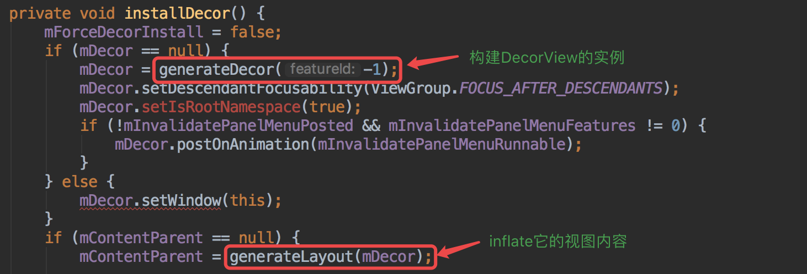
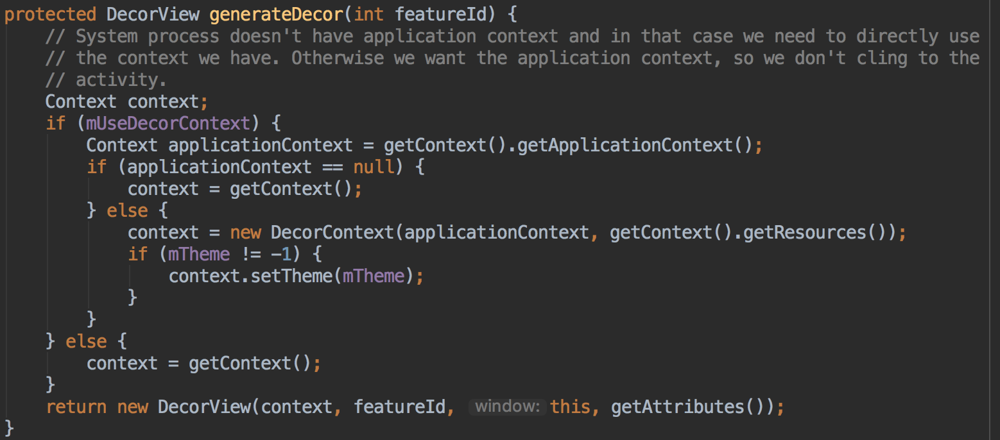
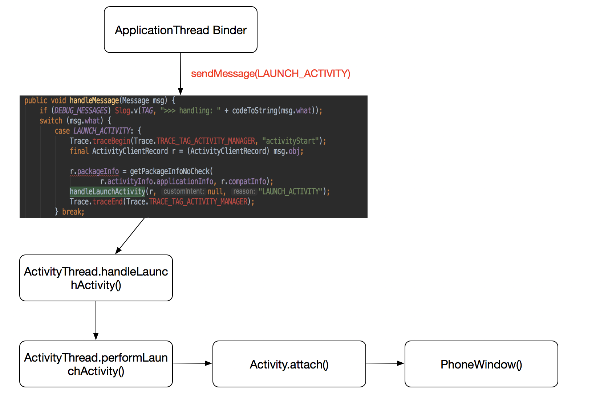
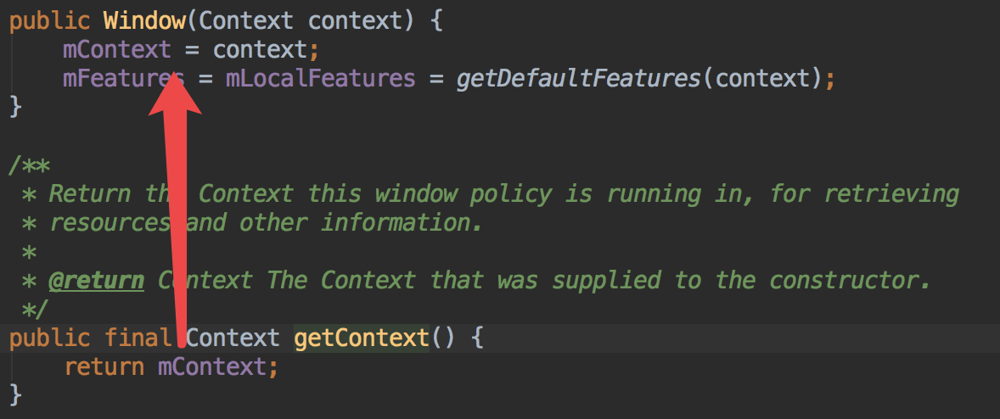
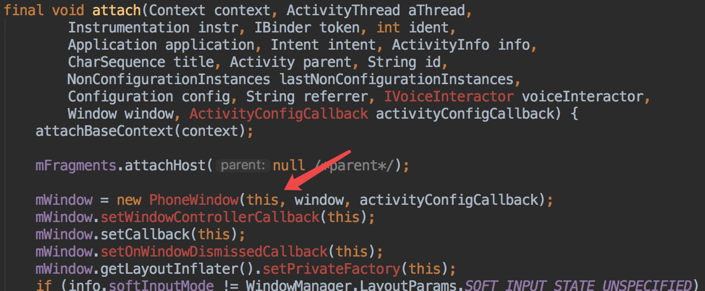
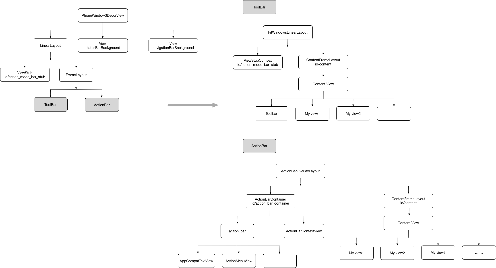
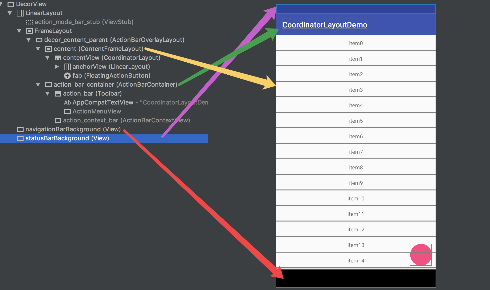
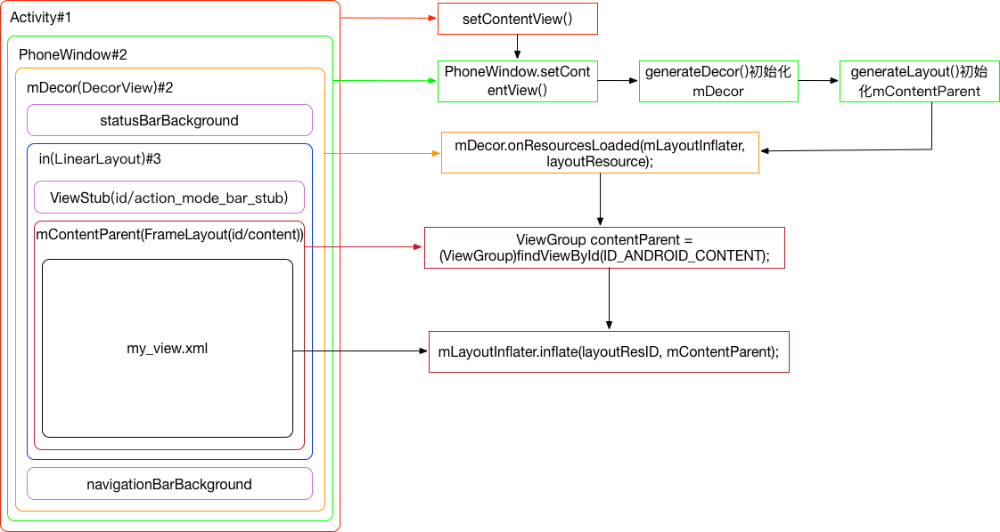

# DecorView是怎么创建出来的？

DecorView是Window的视图。Window的具体实现类是PhoneWindow。

所以DecorView创建的入口就在PhoneWindow，通过`installDecor()`来创建，调用`installDecor()`的地方很多，我们只要看`setContentView()`就好。


DecorView的创建主要是2个部分：



## 1、generateDecor



### 1.1 mUseDecorContext是什么鬼？

PhoneWindow有2个构造函数：

```java
public PhoneWindow(Context context)
public PhoneWindow(Context context, Window preservedWindow,
            ActivityConfigCallback activityConfigCallback)
```

其中第一个是在注入dialog的时候调用，第二个就是activity创建出来的时候调用的。第二个触发的具体的流程是：




### 1.2 DecorContext又是什么鬼？

上面那一大段if代码其实就是想使用applicationContext，而不是activity的context，这样做事为了不需要依附于某个activity的生命周期。

DecorContext就是接受applicationContext作为上下文，同时又能提供一些只有activity上下文才有的功能，如themes、基于activity的resources等。

DecorContext代码：

```java
class DecorContext extends ContextThemeWrapper {
    private PhoneWindow mPhoneWindow;
    private WindowManager mWindowManager;
    private Resources mActivityResources;

    public DecorContext(Context context, Resources activityResources) {
        super(context, null);
        mActivityResources = activityResources;
    }

    void setPhoneWindow(PhoneWindow phoneWindow) {
        mPhoneWindow = phoneWindow;
        mWindowManager = null;
    }

    @Override
    public Object getSystemService(String name) {
        if (Context.WINDOW_SERVICE.equals(name)) {
            if (mWindowManager == null) {
                WindowManagerImpl wm =
                        (WindowManagerImpl) super.getSystemService(Context.WINDOW_SERVICE);
                mWindowManager = wm.createLocalWindowManager(mPhoneWindow);
            }
            return mWindowManager;
        }
        return super.getSystemService(name);
    }

    @Override
    public Resources getResources() {
        return mActivityResources;
    }

    @Override
    public AssetManager getAssets() {
        return mActivityResources.getAssets();
    }
}
```

### 1.3 getContext



mContext其实就是activity。在`Activity.attach()`到window上的时候传入的。具体：



## 2、generateLayout

generateLayout就是来根据实际的场景生成DecorView的内容视图。具体走了下面几个步骤。

### 2.1 getWindowStyle

解析出window style的值，这个的逻辑类似于我们自定义View自定义了style一样。

代码：

```java
TypedArray a = getWindowStyle();

public final TypedArray getWindowStyle() {
        synchronized (this) {
            if (mWindowStyle == null) {
                mWindowStyle = mContext.obtainStyledAttributes(
                        com.android.internal.R.styleable.Window);
            }
            return mWindowStyle;
        }
    }
```

`R.styleable.Window`是系统定义的，它是在系统的`attrs.xml`文件里，属性比较多，不贴出来了。

### 2.2 WindowManager.LayoutParams

根据上面style的信息构建LayoutParams：

```java
WindowManager.LayoutParams params = getAttributes();
```

同时在这个部分会得到`mBackgroundResource`（背景）和`mFrameResource`（前景）的值。

### 2.3 选择layout

这里就是inflate出DecorView的layout布局，根据`features`的值的不同，DecorView会使用不同的layout布局来作为容器。

> features是什么东西？

这里有2个意义上的features：

* mFeatures：是所有可以使用的features，可以被window本身，也可以被它的容器（container）处理。
* mLocalFeatures：只能被window本身处理的features，只是被window所实现。

关于这两个变量的一些操作：

```java
// 返回可以使用的features
protected final int getFeatures(){
    return mFeatures;
}
// 查询某个feature是否可用
public boolean hasFeature(int feature) {
    return (getFeatures() & (1 << feature)) != 0;
}
// 返回被当前window实现的features
protected final int getLocalFeatures(){
    return mLocalFeatures;
}
// window初始的feature值
public static int getDefaultFeatures(Context context) {
        int features = 0;

        final Resources res = context.getResources();
        if (res.getBoolean(com.android.internal.R.bool.config_defaultWindowFeatureOptionsPanel)) {
            features |= 1 << FEATURE_OPTIONS_PANEL;
        }

        if (res.getBoolean(com.android.internal.R.bool.config_defaultWindowFeatureContextMenu)) {
            features |= 1 << FEATURE_CONTEXT_MENU;
        }

        return features;
    }
```

> features有哪些值？

* `FEATURE_OPTIONS_PANEL`：这个是缺省的值
* `FEATURE_NO_TITLE`：no title feature，关闭title bar
* `FEATURE_PROGRESS`：有progress指示的feature，但是21之后被废弃
* `FEATURE_LEFT_ICON`：在title bar的左边有icon
* `FEATURE_RIGHT_ICON`：在title bar的右边有icon
* `FEATURE_INDETERMINATE_PROGRESS`：有进度显示，21之后被废弃
* `FEATURE_CONTEXT_MENU`：Flag for the context menu. This is enabled by default
* `FEATURE_CUSTOM_TITLE`：定制的title，不能和其他包含title的feature结合使用
* `FEATURE_ACTION_BAR`：开启使用actionbar，替换title bar
* `FEATURE_ACTION_BAR_OVERLAY`：使用actionbar，同时是覆盖住window内容的，
* `FEATURE_ACTION_MODE_OVERLAY`：当action bar不存在的情况下，如果这个被允许，action mode ui将被允许覆盖window的内容
* `FEATURE_SWIPE_TO_DISMISS`：标识window可以被关闭通过从左边swipe的
* `FEATURE_CONTENT_TRANSITIONS`：标识window切换的时候将使用`TransitionManager`作为动画
* `FEATURE_ACTIVITY_TRANSITIONS`：标识运行activity的transitions可以通过`android.app.ActivityOptions#makeSceneTransitionAnimation`进行设置

> 布局的选择

根据上面feature的值不同，需要inflate不同的布局。整个的代码逻辑：

```java
int layoutResource;
        int features = getLocalFeatures();
        // System.out.println("Features: 0x" + Integer.toHexString(features));
        if ((features & (1 << FEATURE_SWIPE_TO_DISMISS)) != 0) {
            layoutResource = R.layout.screen_swipe_dismiss;
            setCloseOnSwipeEnabled(true);
        } else if ((features & ((1 << FEATURE_LEFT_ICON) | (1 << FEATURE_RIGHT_ICON))) != 0) {
            if (mIsFloating) {
                TypedValue res = new TypedValue();
                getContext().getTheme().resolveAttribute(
                        R.attr.dialogTitleIconsDecorLayout, res, true);
                layoutResource = res.resourceId;
            } else {
                layoutResource = R.layout.screen_title_icons;
            }
            // XXX Remove this once action bar supports these features.
            removeFeature(FEATURE_ACTION_BAR);
            // System.out.println("Title Icons!");
        } else if ((features & ((1 << FEATURE_PROGRESS) | (1 << FEATURE_INDETERMINATE_PROGRESS))) != 0
                && (features & (1 << FEATURE_ACTION_BAR)) == 0) {
            // Special case for a window with only a progress bar (and title).
            // XXX Need to have a no-title version of embedded windows.
            layoutResource = R.layout.screen_progress;
            // System.out.println("Progress!");
        } else if ((features & (1 << FEATURE_CUSTOM_TITLE)) != 0) {
            // Special case for a window with a custom title.
            // If the window is floating, we need a dialog layout
            if (mIsFloating) {
                TypedValue res = new TypedValue();
                getContext().getTheme().resolveAttribute(
                        R.attr.dialogCustomTitleDecorLayout, res, true);
                layoutResource = res.resourceId;
            } else {
                layoutResource = R.layout.screen_custom_title;
            }
            // XXX Remove this once action bar supports these features.
            removeFeature(FEATURE_ACTION_BAR);
        } else if ((features & (1 << FEATURE_NO_TITLE)) == 0) {
            // If no other features and not embedded, only need a title.
            // If the window is floating, we need a dialog layout
            if (mIsFloating) {
                TypedValue res = new TypedValue();
                getContext().getTheme().resolveAttribute(
                        R.attr.dialogTitleDecorLayout, res, true);
                layoutResource = res.resourceId;
            } else if ((features & (1 << FEATURE_ACTION_BAR)) != 0) {
                layoutResource = a.getResourceId(
                        R.styleable.Window_windowActionBarFullscreenDecorLayout,
                        R.layout.screen_action_bar);
            } else {
                layoutResource = R.layout.screen_title;
            }
            // System.out.println("Title!");
        } else if ((features & (1 << FEATURE_ACTION_MODE_OVERLAY)) != 0) {
            layoutResource = R.layout.screen_simple_overlay_action_mode;
        } else {
            // Embedded, so no decoration is needed.
            layoutResource = R.layout.screen_simple;
            // System.out.println("Simple!");
        }
```

从上面可以知道decorView的layout包括：

* `screen_swipe_dismiss`：对应的是`FEATURE_SWIPE_TO_DISMISS`
* `screen_title_icons`：对应的是`FEATURE_LEFT_ICON`或`FEATURE_RIGHT_ICON`，并且不能是`FEATURE_ACTION_BAR`
* `screen_progress`：就是比`screen_title_icons`少了左右，对应的是`FEATURE_PROGRESS`或`FEATURE_INDETERMINATE_PROGRESS`，并且不能是`FEATURE_ACTION_BAR`
* `screen_custom_title`：对应的是`FEATURE_CUSTOM_TITLE`
* `screen_simple_overlay_action_mode`：对应的是`FEATURE_ACTION_MODE_OVERLAY`
* `screen_action_bar`：不是`FEATURE_NO_TITLE`，并且是`FEATURE_ACTION_BAR`
* `screen_title`：不是`FEATURE_NO_TITLE`，并且不是`FEATURE_ACTION_BAR`，那还是需要title的，则走这个layout
* `screen_simple`：其他的情况都是这个layout，没有title，只有content

### 2.4 inflate

完成了上面layout的选择，后面就是进行布局的加载了。

```java
mDecor.startChanging();
mDecor.onResourcesLoaded(mLayoutInflater, layoutResource);
ViewGroup contentParent = (ViewGroup)findViewById(ID_ANDROID_CONTENT);
if (contentParent == null) {
     throw new RuntimeException("Window couldn't find content container view");
}
```

具体的inflate是在DecorView的`onResourcesLoaded()`里，decorView肯定是需要id为centent的，如果没有则报错。

## 3、设置window

在这个步骤中，会设置window的background、forground和title、titleColor。

```java
if (getContainer() == null) {
            final Drawable background;
            if (mBackgroundResource != 0) {
                background = getContext().getDrawable(mBackgroundResource);
            } else {
                background = mBackgroundDrawable;
            }
            mDecor.setWindowBackground(background);

            final Drawable frame;
            if (mFrameResource != 0) {
                frame = getContext().getDrawable(mFrameResource);
            } else {
                frame = null;
            }
            mDecor.setWindowFrame(frame);

            mDecor.setElevation(mElevation);
            mDecor.setClipToOutline(mClipToOutline);

            if (mTitle != null) {
                setTitle(mTitle);
            }

            if (mTitleColor == 0) {
                mTitleColor = mTextColor;
            }
            setTitleColor(mTitleColor);
        }
```

> **优化提示**

从上面的源码分析可以有2点有价值的开发建议

1. **对于做UI优化，这里可以就是个优化的点，这里的windowBackground就不是必须的，因为它最终会被content覆盖。**
2. **因为背景色是很早就开始绘制，所以我们可以将我们布局的背景色直接放到window上（具体的做法是修改style），这样当跳转时背景色会很快渲染出来**

## 4、inflate content view

加载content view的布局，并且将DecorView作为inflate的根view。这样整个的DecorView树就构建完成了。

## 总结

一个完整的视图是怎样：



真实的情况呢，也要分用Toolbar和ActionBar：




一个window的完整视图：



