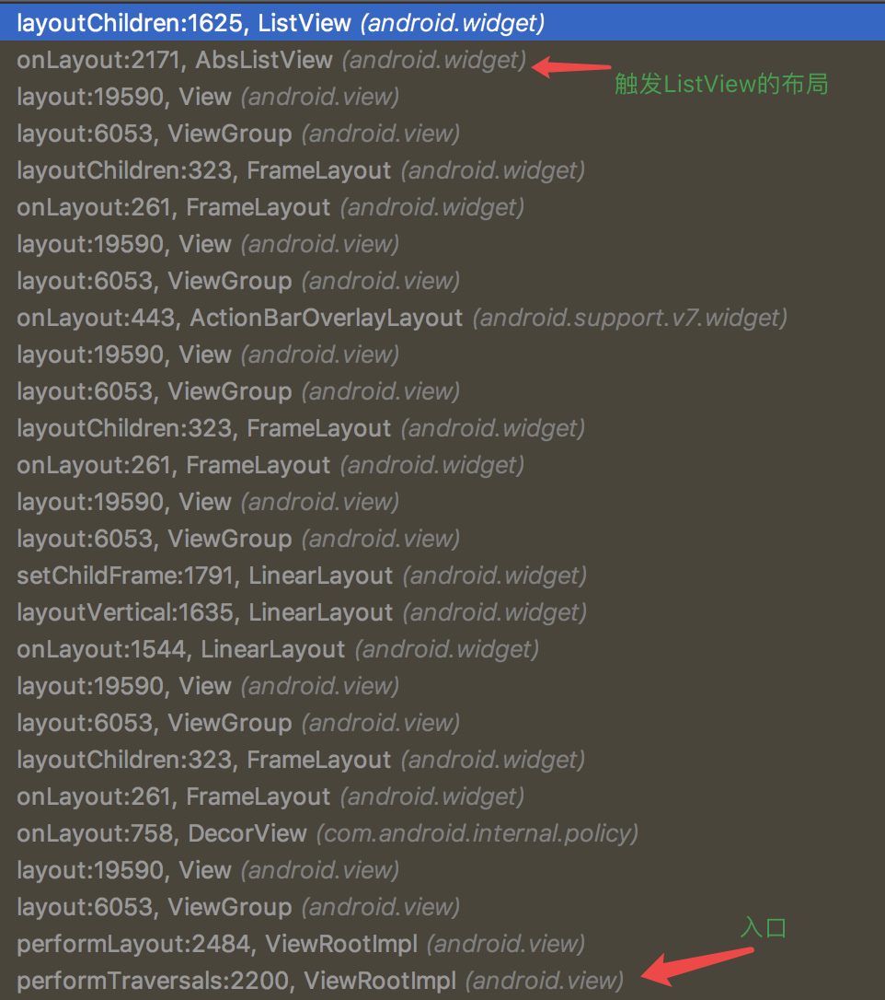
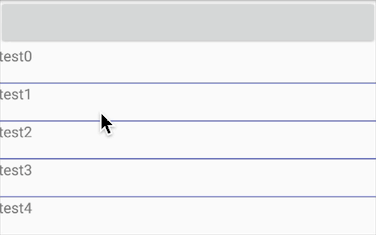
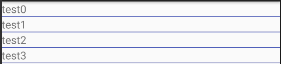
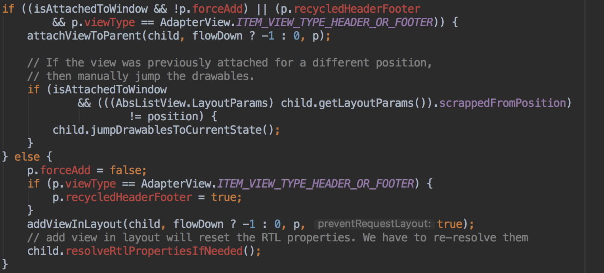
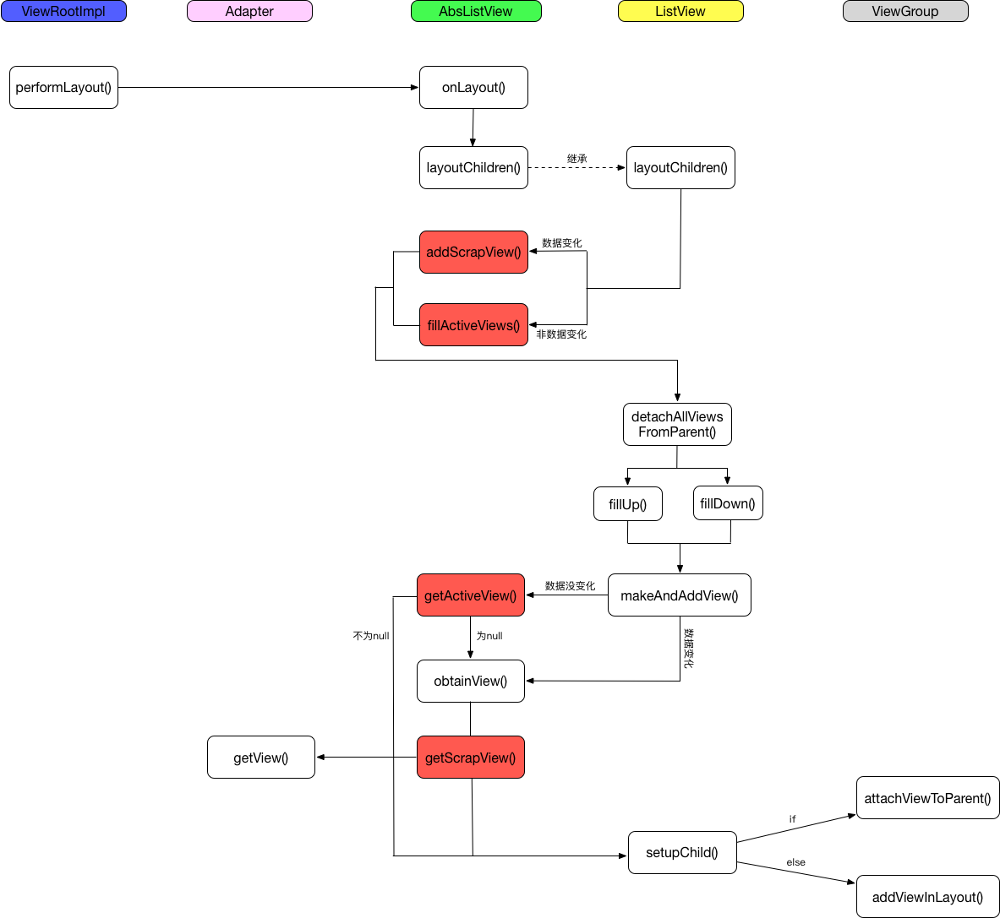

# ListView的回收机制

ListView的回收机制的实现主要是通过内部类`RecycleBin`来实现的，它实现了2个概念的缓存。

* **ActiveViews**：保存的是在屏幕可以见的Views
* **ScrapViews**：保存的是从屏幕滑出去的Views，它的数据是从`ActiveViews`来的

先来了解下ListView内容填充的过程，ListView的绘制是从`ViewRootImpl`的`performLayout()`触发过来的，在AbsListView的`onLayout()`方法里，然后触发`layoutChildren()`方法。



## layoutChildren

先来了解下listview的布局的方式：

* `LAYOUT_FORCE_TOP`：从顶到底的填充list
* `LAYOUT_FORCE_BOTTOM`：从底到顶的填充list
* `LAYOUT_NORMAL`：默认的行为
* `LAYOUT_SET_SELECTION`：填充指定的区域item
* `LAYOUT_SPECIFIC`：
* `LAYOUT_SYNC`：
* `LAYOUT_MOVE_SELECTION`：

在代码上是怎么处理这些：

```java
switch (mLayoutMode) {
case LAYOUT_SET_SELECTION:
    if (newSel != null) {
        sel = fillFromSelection(newSel.getTop(), childrenTop, childrenBottom);
    } else {
        sel = fillFromMiddle(childrenTop, childrenBottom);
    }
    break;
case LAYOUT_SYNC:
    sel = fillSpecific(mSyncPosition, mSpecificTop);
    break;
case LAYOUT_FORCE_BOTTOM:
    sel = fillUp(mItemCount - 1, childrenBottom);
    adjustViewsUpOrDown();
    break;
case LAYOUT_FORCE_TOP:
    mFirstPosition = 0;
    sel = fillFromTop(childrenTop);
    adjustViewsUpOrDown();
    break;
case LAYOUT_SPECIFIC:
    final int selectedPosition = reconcileSelectedPosition();
    sel = fillSpecific(selectedPosition, mSpecificTop);
    /**
     * When ListView is resized, FocusSelector requests an async selection for the
     * previously focused item to make sure it is still visible. If the item is not
     * selectable, it won't regain focus so instead we call FocusSelector
     * to directly request focus on the view after it is visible.
     */
    if (sel == null && mFocusSelector != null) {
        final Runnable focusRunnable = mFocusSelector
                .setupFocusIfValid(selectedPosition);
        if (focusRunnable != null) {
            post(focusRunnable);
        }
    }
    break;
case LAYOUT_MOVE_SELECTION:
    sel = moveSelection(oldSel, newSel, delta, childrenTop, childrenBottom);
    break;
default:
    if (childCount == 0) {
        if (!mStackFromBottom) {
            final int position = lookForSelectablePosition(0, true);
            setSelectedPositionInt(position);
            sel = fillFromTop(childrenTop);
        } else {
            final int position = lookForSelectablePosition(mItemCount - 1, false);
            setSelectedPositionInt(position);
            sel = fillUp(mItemCount - 1, childrenBottom);
        }
    } else {
        if (mSelectedPosition >= 0 && mSelectedPosition < mItemCount) {
            sel = fillSpecific(mSelectedPosition,
                    oldSel == null ? childrenTop : oldSel.getTop());
        } else if (mFirstPosition < mItemCount) {
            sel = fillSpecific(mFirstPosition,
                    oldFirst == null ? childrenTop : oldFirst.getTop());
        } else {
            sel = fillSpecific(0, childrenTop);
        }
    }
    break;
}
```

上面有很多`fillXXX`方法，主要关注下`fillUp()`和`fillDown()`。

> **fillUp(int pos, int nextBottom)**

从当前pos位置开始向上填充，而nextBottom是底部item距离底部的位置。在nextBottom还没到达顶端的前提下，会一直循环到第一个元素。

```java
private View fillUp(int pos, int nextBottom) {
    View selectedView = null;

    int end = 0;
    if ((mGroupFlags & CLIP_TO_PADDING_MASK) == CLIP_TO_PADDING_MASK) {
        end = mListPadding.top;
    }

    while (nextBottom > end && pos >= 0) {
        // is this the selected item?
        boolean selected = pos == mSelectedPosition;
        View child = makeAndAddView(pos, nextBottom, false, mListPadding.left, selected);
        nextBottom = child.getTop() - mDividerHeight;
        if (selected) {
            selectedView = child;
        }
        pos--;
    }

    mFirstPosition = pos + 1;
    setVisibleRangeHint(mFirstPosition, mFirstPosition + getChildCount() - 1);
    return selectedView;
}
```

> **fillDown(int pos, int nextTop)**

从当前pos位置开始向下填充，而nextTop是第一个item顶部的位置。在nextTop没有超过屏幕的大小的前提下，会一直循环到`mItemCount`（adapter里的items的个数）

```java
private View fillDown(int pos, int nextTop) {
    View selectedView = null;

    int end = (mBottom - mTop);
    if ((mGroupFlags & CLIP_TO_PADDING_MASK) == CLIP_TO_PADDING_MASK) {
        end -= mListPadding.bottom;
    }

    while (nextTop < end && pos < mItemCount) {
        // is this the selected item?
        boolean selected = pos == mSelectedPosition;
        View child = makeAndAddView(pos, nextTop, true, mListPadding.left, selected);

        nextTop = child.getBottom() + mDividerHeight;
        if (selected) {
            selectedView = child;
        }
        pos++;
    }

    setVisibleRangeHint(mFirstPosition, mFirstPosition + getChildCount() - 1);
    return selectedView;
}
```

## makeAndAddView

创建item view，并加入到list view中，这个view可能会来自：

* **新建出来**
* **从recyclebin里获取**

具体的参数：

* position：item view在list view中的位置
* y：item view距离top或者bottom的距离
* flow：true代表y是对应top的距离，false代表y是对应bottom的距离，
* childrenLeft：左边距
* selected：item view是否是选中状态

```java
private View makeAndAddView(int position, int y, boolean flow, int childrenLeft,
        boolean selected) {
    if (!mDataChanged) {
        // Try to use an existing view for this position.
        final View activeView = mRecycler.getActiveView(position);
        if (activeView != null) {
            // Found it. We're reusing an existing child, so it just needs
            // to be positioned like a scrap view.
            setupChild(activeView, position, y, flow, childrenLeft, selected, true);
            return activeView;
        }
    }

    // Make a new view for this position, or convert an unused view if
    // possible.
    final View child = obtainView(position, mIsScrap);

    // This needs to be positioned and measured.
    setupChild(child, position, y, flow, childrenLeft, selected, mIsScrap[0]);

    return child;
}
```

> 回收复用

如果数据没有发生变化，即`mDataChanged`为false，那么可以重用RecycleBin里的数据，即`mRecycler.getActiveView(position)`。具体看后面的分析。

> 创建新的

调用`obtainView()`方法，这个方法主要是2块逻辑的处理：

1、重复利用transientView来构建

```java
// Check whether we have a transient state view. Attempt to re-bind the
// data and discard the view if we fail.
final View transientView = mRecycler.getTransientStateView(position);
if (transientView != null) {
    final LayoutParams params = (LayoutParams) transientView.getLayoutParams();

    // If the view type hasn't changed, attempt to re-bind the data.
    if (params.viewType == mAdapter.getItemViewType(position)) {
        final View updatedView = mAdapter.getView(position, transientView, this);

        // If we failed to re-bind the data, scrap the obtained view.
        if (updatedView != transientView) {
            setItemViewLayoutParams(updatedView, position);
            mRecycler.addScrapView(updatedView, position);
        }
    }

    outMetadata[0] = true;

    // Finish the temporary detach started in addScrapView().
    transientView.dispatchFinishTemporaryDetach();
    return transientView;
}
```

**关于View的TransientState**

先看个效果图，要的效果是点击ListView的item，item渐渐的消失。

 

效果对应的代码：

```java
listView.setOnItemClickListener(new AdapterView.OnItemClickListener() {
    @Override
    public void onItemClick(AdapterView<?> parent, final View view, int position, long id) {
        final String item = (String) parent.getItemAtPosition(position);
        ObjectAnimator anim = ObjectAnimator.ofFloat(view, View.ALPHA, 0);
        anim.setDuration(2500);
        anim.addListener(new AnimatorListenerAdapter() {
            @Override
            public void onAnimationEnd(Animator animation) {
                datas.remove(item);
                ((MyAdapter) listView.getAdapter()).notifyDataSetChanged();
            }
        });
        anim.start();
    }
});
```
 

效果对应的代码：

```java
listView.setOnItemClickListener(new AdapterView.OnItemClickListener() {
    @Override
    public void onItemClick(AdapterView<?> parent, final View view, int position, long id) {
        final String item = (String) parent.getItemAtPosition(position);
        ObjectAnimator anim = ObjectAnimator.ofFloat(view, View.ALPHA, 0);
        anim.setDuration(2500);
        // 开启当前状态的保存
        view.setHasTransientState(true);
        anim.addListener(new AnimatorListenerAdapter() {
            @Override
            public void onAnimationEnd(Animator animation) {
                datas.remove(item);
                ((MyAdapter) listView.getAdapter()).notifyDataSetChanged();
                // 取消状态跟踪
                view.setHasTransientState(false);
            }
        });
        anim.start();
    }
});
```

可以看到，第一个效果肯定是有问题的（后面被重用的item也变淡了），这个因为是ListView复用导致的问题。

**而`setHasTransientState()`方法就是设置系统是否要追踪当前view的临时状态（transient state）并且保存住。这个flag的设置时成对出现的，每次的`setHasTransientState(true)`都应该对应这个`setHasTransientState(false)`。**

```java
public void setHasTransientState(boolean hasTransientState) {
    mTransientStateCount = hasTransientState ? mTransientStateCount + 1 :
            mTransientStateCount - 1;
    if (mTransientStateCount < 0) {
        mTransientStateCount = 0;
        Log.e(VIEW_LOG_TAG, "hasTransientState decremented below 0: " +
                "unmatched pair of setHasTransientState calls");
    } else if ((hasTransientState && mTransientStateCount == 1) ||
            (!hasTransientState && mTransientStateCount == 0)) {
        // update flag if we've just incremented up from 0 or decremented down to 0
        mPrivateFlags2 = (mPrivateFlags2 & ~PFLAG2_HAS_TRANSIENT_STATE) |
                (hasTransientState ? PFLAG2_HAS_TRANSIENT_STATE : 0);
        if (mParent != null) {
            try {
                mParent.childHasTransientStateChanged(this, hasTransientState);
            } catch (AbstractMethodError e) {
                Log.e(VIEW_LOG_TAG, mParent.getClass().getSimpleName() +
                        " does not fully implement ViewParent", e);
            }
        }
    }
}
```

所以可以总结`setHasTransientState(true)`的作用是跟踪view的状态并又系统保存住，而不受其他的因素的影响。

可以查询View是否开启TransientState：

```java
public boolean hasTransientState() {
    return (mPrivateFlags2 & PFLAG2_HAS_TRANSIENT_STATE) == PFLAG2_HAS_TRANSIENT_STATE;
}
```

2、直接调用Adapter的getView来创建

```java
final View scrapView = mRecycler.getScrapView(position);
final View child = mAdapter.getView(position, scrapView, this);
if (scrapView != null) {
    if (child != scrapView) {
        // Failed to re-bind the data, return scrap to the heap.
        mRecycler.addScrapView(scrapView, position);
    } else if (child.isTemporarilyDetached()) {
        outMetadata[0] = true;

        // Finish the temporary detach started in addScrapView().
        child.dispatchFinishTemporaryDetach();
    }
}
```

可以看到，在这里回去获取`ScrapView`里缓存的View数据，在调用`getView()`创建后会比较二者是否一致，如果不一致，则需要刷新`ScrapView`里该位置的缓存。

> 3、设置item view的LayoutParams

```java
private void setItemViewLayoutParams(View child, int position) {
    final ViewGroup.LayoutParams vlp = child.getLayoutParams();
    LayoutParams lp;
    if (vlp == null) {
        lp = (LayoutParams) generateDefaultLayoutParams();
    } else if (!checkLayoutParams(vlp)) {
        lp = (LayoutParams) generateLayoutParams(vlp);
    } else {
        lp = (LayoutParams) vlp;
    }

    if (mAdapterHasStableIds) {
        lp.itemId = mAdapter.getItemId(position);
    }
    lp.viewType = mAdapter.getItemViewType(position);
    lp.isEnabled = mAdapter.isEnabled(position);
    if (lp != vlp) {
      child.setLayoutParams(lp);
    }
}
```

这里的LayoutParams是AbsListView重写ViewGroup的LayoutParams，增加了ListView所需要的属性。

**解释一个现象**

下面是我们listView每个Item的布局：

```java
<?xml version="1.0" encoding="utf-8"?>
<LinearLayout
    android:layout_width="match_parent"
    android:layout_height="90dp"
    xmlns:android="http://schemas.android.com/apk/res/android">

    <TextView
        android:id="@+id/tv"
        android:layout_width="match_parent"
        android:textSize="16dp"
        android:layout_height="wrap_content" />
</LinearLayout>
```

可以看到，我们希望这个item是90dp的高度，但是实际情况是，最后运行的效果是`wrap_content`的效果：



这是为啥呢？

**Item View还没有附着到LitView上去，`child.getLayoutParams()`返回的是null，那么会走到`generateDefaultLayoutParams()`方法**：

```java
@Override
protected ViewGroup.LayoutParams generateDefaultLayoutParams() {
    return new AbsListView.LayoutParams(ViewGroup.LayoutParams.MATCH_PARENT,
            ViewGroup.LayoutParams.WRAP_CONTENT, 0);
}
```

可以看到，这里就是高度就是`WRAP_CONTENT`。我们在xml里的设置无效。

那要改怎么处理这个问题呢？？

* **方法一：在子View上设置高度等信息**
* **方法二：在getView里自己设置LayoutParams**

## setupChild

将上面的Item View添加到ListView中去。



添加上去有2种方式：

> 1、attachViewToParent()

进入这里的条件是（满足其一）：

* item view已经被attached到了window上（即时被重用的）
* 是ListView的header或footer

> 2、addViewInLayout() 

这个是我们常用的`addView()`方法真正实现逻辑功能的部分，当然我们也可以在自己的代码中调用这个方法：

```java
Button button = new Button(getContext());
button.setText("1234");
button.setBackgroundColor(Color.RED);
addViewInLayout(button, 0, new FrameLayout.LayoutParams(LayoutParams.MATCH_PARENT, 200), true);
```

## 关于回收的具体操作

### fillActiveViews()

这里是当前页面可见item保存到ActiveViews里面去。

```java
// childCount：mActiveViews需要保存的item个数
// firstActivePosition：第一个item的position
void fillActiveViews(int childCount, int firstActivePosition) {
    if (mActiveViews.length < childCount) {
        mActiveViews = new View[childCount];
    }
    mFirstActivePosition = firstActivePosition;

    //noinspection MismatchedReadAndWriteOfArray
    final View[] activeViews = mActiveViews;
    for (int i = 0; i < childCount; i++) {
        View child = getChildAt(i);
        AbsListView.LayoutParams lp = (AbsListView.LayoutParams) child.getLayoutParams();
        // Don't put header or footer views into the scrap heap
        if (lp != null && lp.viewType != ITEM_VIEW_TYPE_HEADER_OR_FOOTER) {
            // Note:  We do place AdapterView.ITEM_VIEW_TYPE_IGNORE in active views.
            //        However, we will NOT place them into scrap views.
            activeViews[i] = child;
            // Remember the position so that setupChild() doesn't reset state.
            lp.scrappedFromPosition = firstActivePosition + i;
        }
    }
}
```

这个只会在`layoutChildren()`方法里调用。注意这里不会缓存header和footer的views。

### getActiveView()

这个就是根据position获取保存在ActiveView里的View。

```java
View getActiveView(int position) {
    int index = position - mFirstActivePosition;
    final View[] activeViews = mActiveViews;
    if (index >=0 && index < activeViews.length) {
        final View match = activeViews[index];
        activeViews[index] = null;
        return match;
    }
    return null;
}
```

这个方法就是在`makeAndAddView()`方法里调用的了，在尝试创建新的View之前，先尝试从ActiveView获取。

### addScrapView()

```java
void addScrapView(View scrap, int position) {
    final AbsListView.LayoutParams lp = (AbsListView.LayoutParams) scrap.getLayoutParams();
    if (lp == null) {
        // Can't recycle, but we don't know anything about the view.
        // Ignore it completely.
        return;
    }

    lp.scrappedFromPosition = position;

    // Remove but don't scrap header or footer views, or views that
    // should otherwise not be recycled.
    final int viewType = lp.viewType;
    if (!shouldRecycleViewType(viewType)) {
        // Can't recycle. If it's not a header or footer, which have
        // special handling and should be ignored, then skip the scrap
        // heap and we'll fully detach the view later.
        if (viewType != ITEM_VIEW_TYPE_HEADER_OR_FOOTER) {
            getSkippedScrap().add(scrap);
        }
        return;
    }

    scrap.dispatchStartTemporaryDetach();

    // The the accessibility state of the view may change while temporary
    // detached and we do not allow detached views to fire accessibility
    // events. So we are announcing that the subtree changed giving a chance
    // to clients holding on to a view in this subtree to refresh it.
    notifyViewAccessibilityStateChangedIfNeeded(
            AccessibilityEvent.CONTENT_CHANGE_TYPE_SUBTREE);

    // Don't scrap views that have transient state.
    final boolean scrapHasTransientState = scrap.hasTransientState();
    if (scrapHasTransientState) {
        if (mAdapter != null && mAdapterHasStableIds) {
            // If the adapter has stable IDs, we can reuse the view for
            // the same data.
            if (mTransientStateViewsById == null) {
                mTransientStateViewsById = new LongSparseArray<>();
            }
            mTransientStateViewsById.put(lp.itemId, scrap);
        } else if (!mDataChanged) {
            // If the data hasn't changed, we can reuse the views at
            // their old positions.
            if (mTransientStateViews == null) {
                mTransientStateViews = new SparseArray<>();
            }
            mTransientStateViews.put(position, scrap);
        } else {
            // Otherwise, we'll have to remove the view and start over.
            clearScrapForRebind(scrap);
            getSkippedScrap().add(scrap);
        }
    } else {
        clearScrapForRebind(scrap);
        if (mViewTypeCount == 1) {
            mCurrentScrap.add(scrap);
        } else {
            mScrapViews[viewType].add(scrap);
        }

        if (mRecyclerListener != null) {
            mRecyclerListener.onMovedToScrapHeap(scrap);
        }
    }
}
```

分几块理解：

1. 是不是需要放入到SkippedScrap里？**viewType<0并且不是header或footer的情况下就会放入到SkippedScrap里**
2. 不保存有transient state的View，这个会专门的放入到对用的TransientStateViews里
3. 将View放入到SkippedScrap里

我们知道ListView可以显示多种类型的Item，所以在保存SkippedScrap时，也做了区分：

```java
private ArrayList<View> mCurrentScrap;
private ArrayList<View>[] mScrapViews;

if (mViewTypeCount == 1) {
    mCurrentScrap.add(scrap);
} else {
    mScrapViews[viewType].add(scrap);
}
```

在`layoutChildren()`里，如果数据发生了变化，就会存入到SkippedScrap里，存储的是以前老的数据哦~

### getScrapView()

```java
View getScrapView(int position) {
    final int whichScrap = mAdapter.getItemViewType(position);
    if (whichScrap < 0) {
        return null;
    }
    if (mViewTypeCount == 1) {
        return retrieveFromScrap(mCurrentScrap, position);
    } else if (whichScrap < mScrapViews.length) {
        return retrieveFromScrap(mScrapViews[whichScrap], position);
    }
    return null;
}
```

在`obtainView()`方法里，可以作为contentView传给`getView()`方法。

```java
final View scrapView = mRecycler.getScrapView(position);
final View child = mAdapter.getView(position, scrapView, this);
```

至此，ListView的整个流程和回收机制分析完毕：



## 更多的细节

### 1、layoutChildren()的触发时机

除了上面提到的在`onLayout()`里将触发整个方法外，`layoutChildren()`还有很多其他触发时机。这也是ListView的特殊性导致的。

* `onWindowFocusChanged`：在hasWindowFocus为true，并且是touch mode变化的情况下，将会触发
* `onTouchUp`
* `onTouchMove`
* `fling`
* `CheckForTap`：这是个Runnable，它在`onTouchDown`触发
* 适配器的`notifyDataSetChanged()`

#### 2、关于mDataChanged字段

首先这个字段是定义在`AdapterView`里的：

```java
/**
 * True if the data has changed since the last layout
 */
boolean mDataChanged;
```

这个字段就是来表示数据是否变化，这个影响到了view的缓存与回收。关于Adapter的介绍请看：[Adapter分析](./Adapter分析.md)
