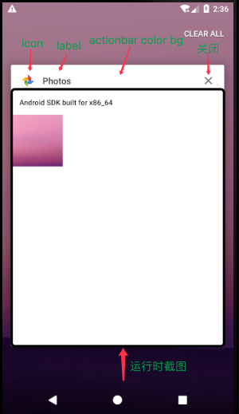
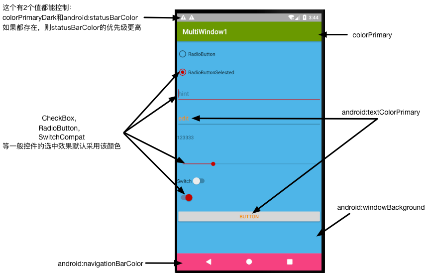
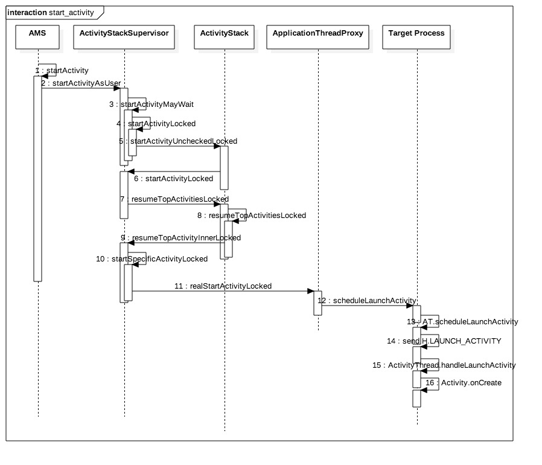
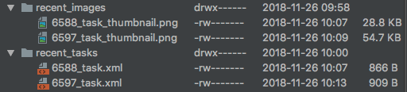
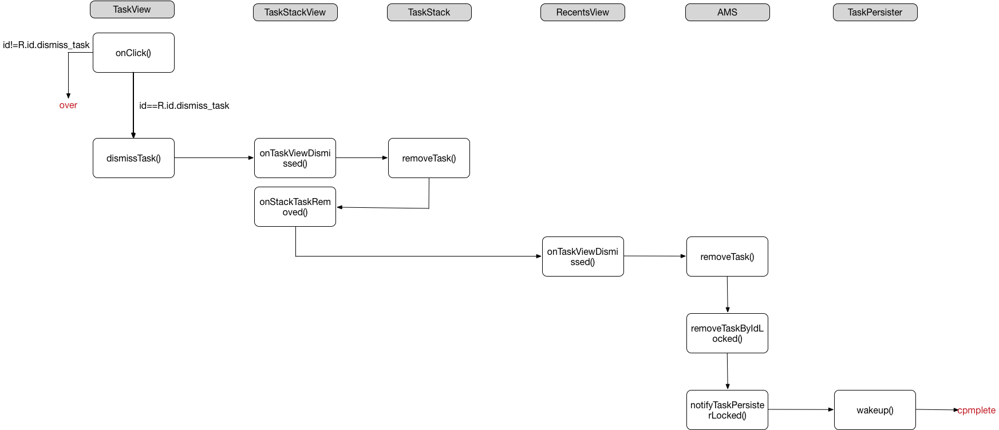
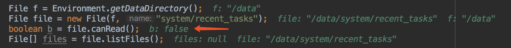
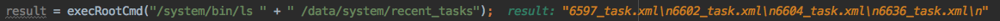
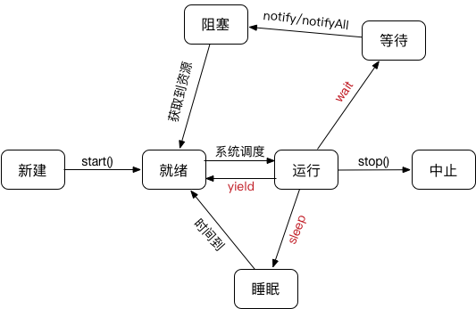

## Overview Screen

Overview Screen即预览屏幕，提供了一个列表视图，方便用户简单快捷地操作最近使用的app或者任务。

预览屏幕也经历了一个发展的过程，该功能是4.0引入的，在5.0之后有了重大的改变。

* UI上更加好看，更符合Material Design
* 可配置性增强，开发者可以改变自己activity的展示形式和风格

### 基础介绍

在5.0之前，预览屏幕每项的显示是label、launcher icon和应用的截图，并且这是无法自定义的。

5.0之后的，预览屏幕更加的“卡片化”，每项的默认显示是label、launcher icon、actionbar color和应用的截图，这些都是可以自定义设置。



#### theme

上面几个值的数据来自：

* launcher icon来自`android:icon`的值
* label来自`android:label`的值
* actionbar color来着`android:theme`下的**colorPrimary**的值

**这些值优先来自当前activity（就是切换到预览屏幕时刻的activity）上的清单配置，如果当前activity没有配置，则会使用application上的配置。**

**需要注意的是，label文字的颜色是不能直接设置的，系统会根据顶部栏的颜色自动设置标签文字的颜色。如果顶部栏是暗色，标签文字将为白色，否则，标签文字颜色将为黑色。**

> 关于colorPrimary、colorPrimaryDark、colorAccent等属性



还有一些其他色值：

* `colorControlHighlight`：控件按压时的色调
* `colorControlActivated`：控件选中时的颜色，默认使用colorAccent

**需要注意的是，上面的很多theme属性是从5.0才开始引入的，所以如果app的最低sdk不是5.0以上，则需要使用V7 appcompat包，并让theme继承类似AppCompat的theme。**

#### 自定义

##### 方式1：xml方式修改theme值

如上面所述内容。

##### 方式2：代码设置

```java
@Override
    protected void onCreate(Bundle savedInstanceState) {
        super.onCreate(savedInstanceState);
        setContentView(R.layout.test);

        if (Build.VERSION.SDK_INT >= Build.VERSION_CODES.LOLLIPOP) {
            int primaryColor = Color.RED;
            Bitmap iconBitmap = BitmapFactory.decodeResource(getResources(), R.mipmap.test);
            ActivityManager.TaskDescription td = new ActivityManager.TaskDescription("test", iconBitmap, primaryColor);
            setTaskDescription(td);
            iconBitmap.recycle();
        }
    }
```

主要是`TaskDescription`这个类，它的解释就是设置和获取最近任务列表中当前activity的信息。

```java
public static class TaskDescription implements Parcelable {
	... ...
}
```

Activity中的`setTaskDescription`：

```java
public void setTaskDescription(ActivityManager.TaskDescription taskDescription) {
        if (mTaskDescription != taskDescription) {
            mTaskDescription.copyFromPreserveHiddenFields(taskDescription);
            // Scale the icon down to something reasonable if it is provided
            if (taskDescription.getIconFilename() == null && taskDescription.getIcon() != null) {
                final int size = ActivityManager.getLauncherLargeIconSizeInner(this);
                final Bitmap icon = Bitmap.createScaledBitmap(taskDescription.getIcon(), size, size,
                        true);
                mTaskDescription.setIcon(icon);
            }
        }
        try {
            ActivityManager.getService().setTaskDescription(mToken, mTaskDescription);
        } catch (RemoteException e) {
        }
    }
```

### 原理介绍

了解预览屏幕的原理需要设计到2个过程。

#### 任务栈的添加过程

首先需要了解下activity的启动走了哪些步骤：



**PS：这个时序在不同sdk的源码上不是完全一致！这个是6.0上的源码流程。但是这个逻辑是不变的。**

要涉及到的系统类：

* ActivityManagerService
* TaskRecord：task的抽象描述类
* TaskPersister：app任务持久化操作
* RecentTasks：app任务列表
* ActivityStack：activity栈状态和管理类

注意第9步，`resumeTopActivityInnerLocked()`方法，在这个里面完成了activity入栈的操作。

```java
private boolean resumeTopActivityInnerLocked(ActivityRecord prev, ActivityOptions options) {
	... ...
	setResumedActivityLocked(next, "resumeTopActivityInnerLocked");
	... ...
}
```

而`setResumedActivityLocked()`的核心方法是：

```java
private final RecentTasks mRecentTasks;

void setResumedActivityLocked(ActivityRecord r, String reason) {
	... ...
	mRecentTasks.addLocked(task);
	... ...
}
```

`RecentTasks`是个ArrayList类的子类，item的对象为`TaskRecord`。保存了最近的任务列表，而`TaskRecord`是对任务的抽象，描述一个任务。

```java
final void addLocked(TaskRecord task) {
	... ...
	add(0, task);
	mService.notifyTaskPersisterLocked(task, false);
	... ...
}
```

所以任务栈的核心就是将taks放到`RecentTasks`列表的第一个，同时将task持久化到磁盘上。

```java
void notifyTaskPersisterLocked(TaskRecord task, boolean flush) {
    if (task != null && task.stack != null && task.stack.isHomeStack()) {
        // Never persist the home stack.
        return;
    }
    mTaskPersister.wakeup(task, flush);
}
```

首先是过滤掉home页面，这个是不加入到最近任务栈的。然后调用`TaskPersister `类中的`wakeup()`方法。

`TaskPersister`对象是在SystemServer启动的时候初始化的：

```java
public ActivityManagerService(Context systemContext) {
    ... ...
    File dataDir = Environment.getDataDirectory();
    File systemDir = new File(dataDir, "system");
    systemDir.mkdirs();
    mTaskPersister = new TaskPersister(systemDir, mStackSupervisor, mRecentTasks);
    ... ...
}
```

`TaskPersister`的实例化：

```java
TaskPersister(File systemDir, ActivityStackSupervisor stackSupervisor,
            RecentTasks recentTasks) {
        // 关注点1
        sTasksDir = new File(systemDir, TASKS_DIRNAME);
        if (!sTasksDir.exists()) {
            if (DEBUG) Slog.d(TAG, "Creating tasks directory " + sTasksDir);
            if (!sTasksDir.mkdir()) {
                Slog.e(TAG, "Failure creating tasks directory " + sTasksDir);
            }
        }

        // 关注点2
        sImagesDir = new File(systemDir, IMAGES_DIRNAME);
        if (!sImagesDir.exists()) {
            if (DEBUG) Slog.d(TAG, "Creating images directory " + sTasksDir);
            if (!sImagesDir.mkdir()) {
                Slog.e(TAG, "Failure creating images directory " + sImagesDir);
            }
        }

        mStackSupervisor = stackSupervisor;
        mService = stackSupervisor.mService;
        mRecentTasks = recentTasks;
        
        // 关注点3
        mLazyTaskWriterThread = new LazyTaskWriterThread("LazyTaskWriterThread");
    }
```

> 关注点1、2

会保存2个文件目录，分别是：

* `/data/system/recent_tasks/`：这个里面保存的是每个app任务的`TaskRecord`信息，以xml方式写入，注意是一个APP任务一个xml文件
* `/data/system/recent_images/`：这个里面保存的是每个app在预览屏幕上显示的屏幕截图，以png形式保存，注意是一个APP任务一个png文件

它的展示形式如下：



其中xml的形式：

```xml
<?xml version='1.0' encoding='utf-8' standalone='yes' ?>
<task task_id="6597" real_activity="com.speedsoftware.rootexplorer/com.kkkpppxzn" affinity="com.speedsoftware.rootexplorer" root_has_reset="true" auto_remove_recents="false" asked_compat_mode="false" user_id="0" effective_uid="10238" task_type="0" first_active_time="1543198188201" last_active_time="1543198692322" last_time_moved="1543198692306" never_relinquish_identity="true" task_description_color="ff607d8b" task_description_text_color="de000000" task_affiliation_color="-10453621" task_affiliation="6597" prev_affiliation="-1" next_affiliation="-1" calling_uid="10238" calling_package="com.speedsoftware.rootexplorer" multiwindow_style="16777218">
<intent action="android.intent.action.MAIN" component="com.speedsoftware.rootexplorer/com.kkkpppxzn" flags="10200000">
<categories category="android.intent.category.LAUNCHER" />
</intent>
</task>
```

具体写入逻辑是在工作线程中完成的，看代码：

```java
LazyTaskWriterThread:

if (item instanceof ImageWriteQueueItem) {
                    ImageWriteQueueItem imageWriteQueueItem = (ImageWriteQueueItem) item;
                    final String filename = imageWriteQueueItem.mFilename;
                    final Bitmap bitmap = imageWriteQueueItem.mImage;
                    if (DEBUG) Slog.d(TAG, "writing bitmap: filename=" + filename);
                    FileOutputStream imageFile = null;
                    try {
                        imageFile = new FileOutputStream(new File(sImagesDir, filename));
                        bitmap.compress(Bitmap.CompressFormat.PNG, 100, imageFile);
                    } catch (Exception e) {
                        Slog.e(TAG, "saveImage: unable to save " + filename, e);
                    } finally {
                        IoUtils.closeQuietly(imageFile);
                    }
                } else if (item instanceof TaskWriteQueueItem) {
                    // Write out one task.
                    StringWriter stringWriter = null;
                    TaskRecord task = ((TaskWriteQueueItem) item).mTask;
                    if (DEBUG) Slog.d(TAG, "Writing task=" + task);
                    synchronized (mService) {
                        if (task.inRecents) {
                            // Still there.
                            try {
                                if (DEBUG) Slog.d(TAG, "Saving task=" + task);
                                stringWriter = saveToXml(task);
                            } catch (IOException e) {
                            } catch (XmlPullParserException e) {
                            }
                        }
                    }
                    if (stringWriter != null) {
                        // Write out xml file while not holding mService lock.
                        FileOutputStream file = null;
                        AtomicFile atomicFile = null;
                        try {
                            atomicFile = new AtomicFile(new File(sTasksDir, String.valueOf(
                                    task.taskId) + RECENTS_FILENAME + TASK_EXTENSION));
                            file = atomicFile.startWrite();
                            file.write(stringWriter.toString().getBytes());
                            file.write('\n');
                            atomicFile.finishWrite(file);
                        } catch (IOException e) {
                            if (file != null) {
                                atomicFile.failWrite(file);
                            }
                            Slog.e(TAG, "Unable to open " + atomicFile + " for persisting. " +
                                    e);
                        }
                    }
                }
```

具体的写入逻辑不仔细分析，我们来看看什么时候信息会被写入：

* 在打开新app时，会同时新建xml和对应的png
* 在activity跳转时会刷新xml中的信息
* app退出后台（返回键/home键/...），会刷新png（根据最后app停留的屏幕做截屏）
* 在预览屏幕中删除某个item，则会同时删除xml和对应的png
* clear则会清空`recent_tasks`和`recent_images`

> 关注点3

注意这里并没有启动线程，线程的启动时在AMS完成启动系统服务后触发，主要是调用`systemReady()`方法：

```java
public void systemReady(final Runnable goingCallback) {
    ... ...
    mTaskPersister.startPersisting();
    ... ...
}
```

`wakeup`方法：

```java
void wakeup(TaskRecord task, boolean flush) {
	... ...
	mWriteQueue.add(new TaskWriteQueueItem(task));
	notifyAll();
	yieldIfQueueTooDeep();
	... ...
}
```

首先是将任务加入到Queue中，然后唤醒wait中的工作线程，**最后一步的意思是将当前线程让步掉，主动让步CPU时间，使得工作线程可以有机会运行。**

`yieldIfQueueTooDeep()`方法：

```java
private void yieldIfQueueTooDeep() {
    boolean stall = false;
    synchronized (this) {
        if (mNextWriteTime == FLUSH_QUEUE) {
            stall = true;
        }
    }
    if (stall) {
        Thread.yield();
    }
}
```

#### 任务栈中item的删除

可能会涉及到类：

* TaskStackView：a task stack view？？
* TaskView：a task view？？
* TaskViewHeader：
* TaskStack：
* RecentsView：预览屏幕的UI页面

删除一个任务的流程：



具体的代码不做分析了，流程图是依据6.0源码画出来的。

#### 开机加载持久化最近任务

上面持久化到磁盘上，其实是为了开机后也能看到最近任务。**但个人觉得这个功能很鸡肋吧，没啥卵用，开机后app还是要重启，不是直接进入。**

在开机的时候，AMS会在`systemReady()`方法中恢复最近任务列表：

```java
public void systemReady(final Runnable goingCallback) {
    ... ...
    mRecentTasks.clear();
    mRecentTasks.addAll(mTaskPersister.restoreTasksLocked());
    mRecentTasks.cleanupLocked(UserHandle.USER_ALL);
    ... ...
}
```

### 其他关于预览屏幕的操作

> 禁止展示在Overview Screen

通过将`<activity>`属性`android:excludeFromRecents`设置为true，您可以始终将任务从概览屏幕中完全排除

> 关于单app多个任务栈形式
 
document类型的屏幕预览：[https://developer.android.com/guide/components/recents](https://developer.android.com/guide/components/recents)

> 删除任务栈

ActivityManager里有个方法`removeTask`，它是个hide方法，无法直接调用：

```java
/**
     * Completely remove the given task.
     *
     * @param taskId Identifier of the task to be removed.
     * @return Returns true if the given task was found and removed.
     *
     * @hide
     */
    public boolean removeTask(int taskId) throws SecurityException {
        try {
            return ActivityManagerNative.getDefault().removeTask(taskId);
        } catch (RemoteException e) {
            // System dead, we will be dead too soon!
            return false;
        }
    }
```

我们可以通过反射的方法处理：

```java
ActivityManager am = (ActivityManager) getSystemService(Context.ACTIVITY_SERVICE);
                Method method = null;
                try {
                    method = ActivityManager.class.getMethod("removeTask", int.class);
                    method.setAccessible(true);
                    Object o = method.invoke(am, getTaskId());
                    method.setAccessible(false);
                    if (o instanceof Boolean) {
                        boolean success = (boolean) o;
                        if (success) {
                            Log.e("111", "you can not see me~~~");
                        } else {
                            Log.e("111", "you can still see!!!");
                        }
                    }
                } catch (NoSuchMethodException e) {
                    e.printStackTrace();
                } catch (IllegalAccessException e) {
                    e.printStackTrace();
                } catch (InvocationTargetException e) {
                    e.printStackTrace();
                }
```

**这个的用处是，如果不想讲app加入最近任务栈，则可以在onDestory()中将它移除掉。**

> 获取任务栈列表

api方式：

```java
ActivityManager am = (ActivityManager) getSystemService(Context.ACTIVITY_SERVICE);
List<ActivityManager.RecentTaskInfo> tasks = am.getRecentTasks(10, RECENT_WITH_EXCLUDED);
```

**这个方法在API21已经废除，但是21以上还是可以返回数据，只是只能返回自己app的数据而已。这个是出于安全的考虑，返回其他App的信息有可能会泄漏用户的个人信息。（除了返回自己的app信息，同时尽可能会返回一些其他不敏感信息，如home界面）**

FLAG：只是返回什么样的数据

* `RECENT_WITH_EXCLUDED`：返回所有的，即时是设置了`FLAG_ACTIVITY_EXCLUDE_FROM_RECENTS`
* `RECENT_IGNORE_UNAVAILABLE`：返回那些对用户还是可达的任务列表

> 获取任务栈列表2 —— Geek思路

从前面的分析可以看出，最近任务列表持久化在了/data/system目录下，是否可以通过直接读文件的方式知道有哪些列表？



这么去读的话，则返回的是空数据，因为是不可读的。

**采用以Su授权的方式，以root角色去读取，前提条件是手机必须是root的。**



代码如下：

```java
result = execRootCmd("/system/bin/ls " + " /data/system/recent_tasks");

// 以root权限执行并获取输出
public String execRootCmd(String cmd) {
        DataInputStream is = null;
        DataOutputStream os = null;
        String content = "";
        Process process = null;
        try {
            process = Runtime.getRuntime().exec("su");
            os = new DataOutputStream(process.getOutputStream());
            is = new DataInputStream(process.getInputStream());
            os.writeBytes(cmd + "\nexit\n");
            os.flush();
            while (true) {
                String line = is.readLine();
                if (line == null) {
                    break;
                }
                content += line + "\n";
            }
            return content;
        } catch (Exception e) {
            e.printStackTrace();
        } finally {
            try {
                if (is != null) {
                    is.close();
                }
                if (os != null) {
                    os.close();
                }
                process.destroy();
            } catch (Exception e) {
            }
        }
        return "";
    }
```

## 扩展学习

上面说到了调用线程会自己主动`Thread.yield()`，释放自己的资源，让工作线程运行。

**使当前线程从执行状态（运行状态）变为可执行态（就绪状态）。cpu会从众多的可执行态里选择，也就是说，当前也就是刚刚的那个线程还是有可能会被再次执行到的，并不是说一定会执行其他线程而该线程在下一次中不会执行到了。**

一个例子：

```java
/**
 * Created by panda on 2018/6/26
 **/
public class Test {

    public static void main(String[] args) {
        MyThread yt1 = new MyThread("thread_A");
        MyThread yt2 = new MyThread("thread_B");
        yt1.start();
        yt2.start();
    }

    public static class MyThread extends Thread {
        MyThread(String name) {
            super(name);
        }

        @Override
        public void run() {
            for (int i = 1; i <= 10; i++) {
                System.out.println(this.getName() + "-----" + i);
                MyThread.yield();
            }
        }
    }
}
```

结果【注意最后4条，线程切换是随机的~】：

```xml
thread_A-----1
thread_B-----1
thread_A-----2
thread_B-----2
thread_A-----3
thread_B-----3
thread_A-----4
thread_B-----4
thread_A-----5
thread_B-----5
thread_A-----6
thread_B-----6
thread_A-----7
thread_B-----7
thread_A-----8
thread_B-----8
thread_A-----9
thread_B-----9
thread_B-----10
thread_A-----10
```

如果将`MyThread.yield()`去掉呢：

```xml
thread_A-----1
thread_A-----2
thread_A-----3
thread_A-----4
thread_A-----5
thread_A-----6
thread_A-----7
thread_A-----8
thread_A-----9
thread_A-----10
thread_B-----1
thread_B-----2
thread_B-----3
thread_B-----4
thread_B-----5
thread_B-----6
thread_B-----7
thread_B-----8
thread_B-----9
thread_B-----10
```

> sleep、wait、yield

* sleep的线程是不会释放资源的，而wait和yield是会释放所持有的资源
* sleep和yield是Thread的静态方法，是作用在当前线程上的，而wait是实例方法（直接定义在Object上，**并且只能在其他线程调用本实例的notify才能唤醒**）
* **wait操作（包括notify）必须在对象的synchronize块中被调用，否则直接报错**，而sleep和yield随意调用
* sleep调用的线程在时间结束后会进入运行状态，wait被notify后并不能保证马上执行，而是进入到阻塞状态等待，yield则是给各线程重新公平抢占资源的机会，是否执行完全又线程调度去决定（所以yield是不可靠的）

线程转移图：



> 关于wait和synchronize的关系

上面说了，wait/notify必须在synchronize块中进行调用，否则报错：

```java
java.lang.IllegalMonitorStateException
```
它指的是当前线程在没有持有对象的monitor的情况下，线程尝试调用wait，或者调用notify，在这种情况下会报错。

什么是monitor？**Java中每个类和对象都有一个同步锁，只有获取到调用同步锁，调用wait和notify方法才行。**线程必须拥有此对象监视器，这样才能获取到所有权并执行等待。

一个关于wait的例子：

```java
/**
 * Created by panda on 2018/6/26
 **/
public class Test {
    protected int numStart = 1;
    protected boolean isStopNumeral = false;

    private final Object o1 = new Object();
    private final Object o2 = new Object();

    public static void main(String[] args) {
        Test t = new Test();
        new Thread(t.numeralThread()).start();
        new Thread(t.characterThread(buildCharArr(26))).start();
    }

    private Runnable numeralThread() {
        return new Runnable() {
            public void run() {
                try {
                    while (!isStopNumeral) {
                        System.out.print((numStart++) + " ");
                        Thread.sleep(100);

                        /**
                         * notify和wait的操作
                         *
                         * 在整个同步块中，防止o1和o2都被notify了。然后先notify对方，最后wait自己的线程
                         */
                        synchronized (Test.this) {
                            synchronized (o2) {
                                o2.notify();
                            }
                        }
                        synchronized (o1) {
                            o1.wait();
                        }
                    }
                } catch (InterruptedException e) {

                }
            }
        };
    }

    private Runnable characterThread(final String[] charArrays) {
        return new Runnable() {
            public void run() {
                try {
                    for (int i = 0; i < charArrays.length; i++) {
                        System.out.print(charArrays[i] + " ");
                        if (i >= charArrays.length - 1) {
                            isStopNumeral = true;
                            break;
                        }
                        Thread.sleep(100);

                        /**
                         * notify和wait的操作
                         *
                         * 在整个同步块中，防止o1和o2都被notify了。然后先notify对方，最后wait自己的线程
                         */
                        synchronized (Test.this) {
                            synchronized (o1) {
                                o1.notify();
                            }
                        }
                        synchronized (o2) {
                            o2.wait();
                        }
                    }
                } catch (InterruptedException e) {

                }
            }
        };
    }

    /**
     * 构建26个字母
     *
     * @param max
     * @return
     */
    private static String[] buildCharArr(int max) {
        String[] charArr = new String[max];
        int tmp = 65;
        for(int i=0;i<max;i++){
            charArr[i] = String.valueOf((char)(tmp+i));
        }
        return charArr;
    }
}
```

扩展阅读：
[https://javarevisited.blogspot.com/2011/05/wait-notify-and-notifyall-in-java.html](https://javarevisited.blogspot.com/2011/05/wait-notify-and-notifyall-in-java.html)