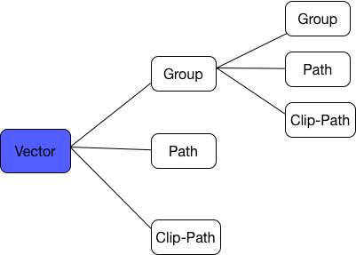

# Vector的介绍

## Vector的优势

* 能自动的进行适配，不再需要多张适配的图片（**矢量图与位图的差别，就在于矢量图可以尽可能的放大而不失真**）
* 同样的一张位图片，Vector的实现要比PNG的小很多
* 支持做动画效果的位图

## Vector语法

这个不是重点，因为Vector的代码可以直接通过SVG（可缩放矢量图形）转过来，SVG可以从设计师的PNG转过来。

Vector的基本构成：



详细的语法在此不做介绍，读者可在网上查找。

## Vector的兼容性

Vector是在Android L上提出的概念，为了向下兼容，在AppCompat23.2上支持了低版本的使用，同时Gradle Plugin是2.0及以上。

```xml
android {
    defaultConfig {
        vectorDrawables.useSupportLibrary = true
    }
}
```

同时需要注意，应用中的Activity/Fragment需要是继承自AppCompat包里的Activity/Fragment。

**使用了兼容包，在使用的时候就不是用`android:src`，而是使用`app:srcCompat`了。**

## Vector Asset

在AS里，可以打开Vector Asset来制作自己的Vector。可以使用系统给我们提供的Material风格的Icon，也可以用生成好的SVG文件转换。

## 在控件中的使用

### 静态的使用

它对应的是`VectorDrawableCompat`或`VectorDrawable`类。

Vector xml：

```xml
<vector xmlns:android="http://schemas.android.com/apk/res/android"
        android:width="24dp"
        android:height="24dp"
        android:viewportWidth="24.0"
        android:viewportHeight="24.0">

    <path
        android:fillColor="#FF000000"
        android:pathData="M19,12h-2v3h-3v2h5v-5zM7,9h3L10,7L5,7v5h2L7,9zM21,3L3,3c-1.1,0 -2,0.9 -2,2v14c0,1.1 0.9,2 2,2h18c1.1,0 2,-0.9 2,-2L23,5c0,-1.1 -0.9,-2 -2,-2zM21,19.01L3,19.01L3,4.99h18v14.02z"/>
</vector>
```

导入ImageView：

```java
<ImageView
    android:id="@+id/image"
    app:srcCompat="@drawable/ic_aspect_ratio_black_24dp"
    android:layout_width="100dp"
    android:layout_height="100dp"/>
```

当然也可以在代码中设置drawable：

```java
imageView.setImageResource(R.drawable. ic_aspect_ratio_black_24dp);
```

### 动态的使用

Vector更为你更为牛逼的地方是它可以实现动画。它对应的是`AnimatedVectorDrawableCompat`或`AnimatedVectorDrawable`类。

> 图像资源

即需要做动画的Vector资源文件。

```xml
<vector xmlns:android="http://schemas.android.com/apk/res/android"
   android:height="64dp"
   android:width="64dp"
   android:viewportHeight="600"
   android:viewportWidth="600" >
   <group
      android:name="rotationGroup"
      android:pivotX="300.0"
      android:pivotY="300.0"
      android:rotation="45.0" >
      <path
         android:name="vectorPath"
         android:fillColor="#000000"
         android:pathData="M300,70 l 0,-70 70,70 0,0 -70,70z" />
   </group>
</vector>
```

> AnimatedVector

它是动画和图像的整合器。

```xml
<animated-vector xmlns:android="http://schemas.android.com/apk/res/android"
   android:drawable="@drawable/vd" >
     <target
         android:name="rotationGroup"
         android:animation="@anim/rotation" />
</animated-vector>
```

**这里可有多个target，其中`android:name`是对应上面Vector图像某个单元的`android:name`**

> ObjectAnimator

动画资源。

```xml
<objectAnimator
   android:duration="6000"
   android:propertyName="rotation"
   android:valueFrom="0"
   android:valueTo="360" />
```

> 启动

不启动是无法有动画效果的。

```java
ImageView imageView = findViewById(R.id.image);
imageView.setImageResource(R.drawable.avd);
if(imageView.getDrawable() instanceof Animatable){
    ((Animatable) imageView.getDrawable()).start();
}
```

对于动画，有更方便的方式，但是需要Build Tools 24或更高。具体可看google的文档。

**更多好玩的例子可以转到：[https://github.com/xuyisheng/VectorDemo](https://github.com/xuyisheng/VectorDemo)**

## Vector的性能优化建议

* Vector尽量简单化。过于复杂的操作会影响绘制的效率，初始化也会比较耗时
* 减少vector图像的大小。因为vector首先会被转成bitmaps，然后传到GPU的texture，大的图像以为这更多的内存消耗和上传到GPU的时间（**因此建议使用在icon型的图标上**）
* 对Vector图像不要做修改，这样可以使用bitmap的缓存

