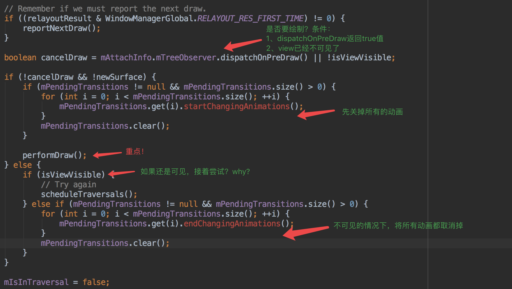
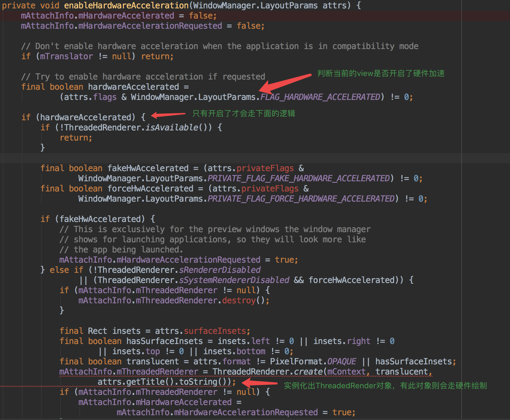
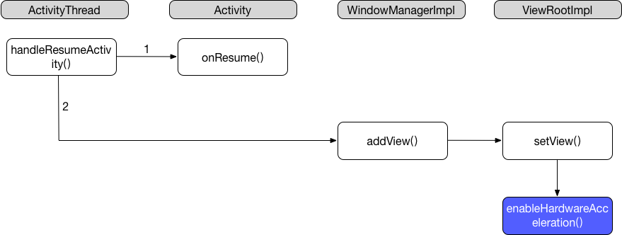
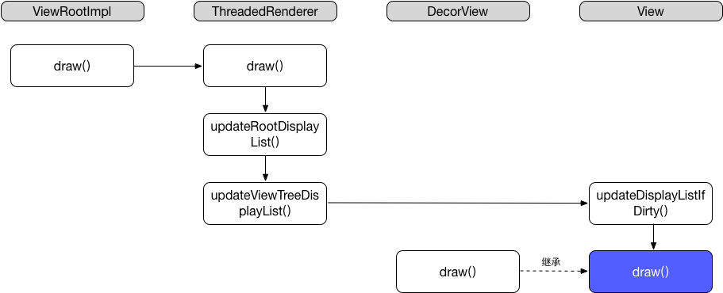
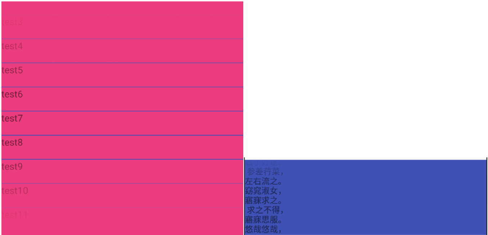
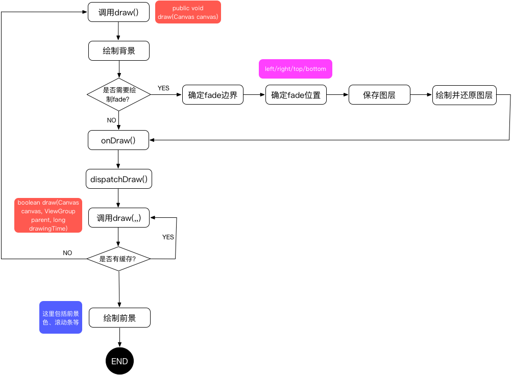

# View.Draw过程的深度分析

在完成了[View.Measure过程的深度分析](./View.Measure过程的深度分析.md)和[View.Layout过程的深度分析](./View.Layout过程的深度分析.md)之后，进入到draw的阶段。

还是从`performTraversals()`开始：



`performDraw()`：

```java
private void performDraw() {
    if (mAttachInfo.mDisplayState == Display.STATE_OFF && !mReportNextDraw) {
        return;
    } else if (mView == null) {
        return;
    }

    final boolean fullRedrawNeeded = mFullRedrawNeeded;
    mFullRedrawNeeded = false;

    mIsDrawing = true;
    Trace.traceBegin(Trace.TRACE_TAG_VIEW, "draw");
    try {
        draw(fullRedrawNeeded);
    } finally {
        mIsDrawing = false;
        Trace.traceEnd(Trace.TRACE_TAG_VIEW);
    }
    
    ... ...
}
```

## ViewRootImpl.draw()

`draw()`方法，参数表示是否是重新绘制全部视图。

> trackFPS()

这个是在`DEBUG_FPS`为true的时候才会触发，就是了解下系统是如何计算fps的：

```java
private void trackFPS() {
    // Tracks frames per second drawn. First value in a series of draws may be bogus
    // because it down not account for the intervening idle time
    long nowTime = System.currentTimeMillis();
    if (mFpsStartTime < 0) {
        mFpsStartTime = mFpsPrevTime = nowTime;
        mFpsNumFrames = 0;
    } else {
        ++mFpsNumFrames;
        String thisHash = Integer.toHexString(System.identityHashCode(this));
        long frameTime = nowTime - mFpsPrevTime;
        long totalTime = nowTime - mFpsStartTime;
        Log.v(mTag, "0x" + thisHash + "\tFrame time:\t" + frameTime);
        mFpsPrevTime = nowTime;
        if (totalTime > 1000) {
            float fps = (float) mFpsNumFrames * 1000 / totalTime;
            Log.v(mTag, "0x" + thisHash + "\tFPS:\t" + fps);
            mFpsStartTime = nowTime;
            mFpsNumFrames = 0;
        }
    }
}
```

> 计算需要绘制的区域

```java
final Rect dirty = mDirty;
if (mSurfaceHolder != null) {
    // The app owns the surface, we won't draw.
    dirty.setEmpty();
    if (animating && mScroller != null) {
        mScroller.abortAnimation();
    }
    return;
}

if (fullRedrawNeeded) {
    mAttachInfo.mIgnoreDirtyState = true;
    dirty.set(0, 0, (int) (mWidth * appScale + 0.5f), (int) (mHeight * appScale + 0.5f));
}
```

其中`mDirty`的值是在layout阶段计算来的。

> 触发绘制

实际的`draw()`操作，有两种方式：

* 采用硬件绘制，调用`ThreadedRenderer`的代码
* 采用软件绘制

```java
if (!dirty.isEmpty() || mIsAnimating || accessibilityFocusDirty) {
    if (mAttachInfo.mThreadedRenderer != null && mAttachInfo.mThreadedRenderer.isEnabled()) {
        mIsAnimating = false;

        if (mHardwareYOffset != yOffset || mHardwareXOffset != xOffset) {
            mHardwareYOffset = yOffset;
            mHardwareXOffset = xOffset;
            invalidateRoot = true;
        }

        if (invalidateRoot) {
            mAttachInfo.mThreadedRenderer.invalidateRoot();
        }

        dirty.setEmpty();
        final boolean updated = updateContentDrawBounds();

        if (mReportNextDraw) {
			mAttachInfo.mThreadedRenderer.setStopped(false);
        }

        if (updated) {
            requestDrawWindow();
        }
        // 走硬件绘制的逻辑
        mAttachInfo.mThreadedRenderer.draw(mView, mAttachInfo, this);
    } else {
        if (mAttachInfo.mThreadedRenderer != null &&
                !mAttachInfo.mThreadedRenderer.isEnabled() &&
                mAttachInfo.mThreadedRenderer.isRequested()) {

            try {
                mAttachInfo.mThreadedRenderer.initializeIfNeeded(
                        mWidth, mHeight, mAttachInfo, mSurface, surfaceInsets);
            } catch (OutOfResourcesException e) {
                handleOutOfResourcesException(e);
                return;
            }

            mFullRedrawNeeded = true;
            scheduleTraversals();
            return;
        }

		  // 走软件绘制的逻辑
        if (!drawSoftware(surface, mAttachInfo, xOffset, yOffset, scalingRequired, dirty)) {
            return;
        }
    }
}
```

**这个是怎么控制的呢？**

看是否开启了硬件加速，SDK 16以后硬件加速是默认开启的，关于硬件加速的介绍请看[硬件加速优化](./ui-hardware-accelerate.md)

方法的控制是在`ViewRootImpl.enableHardwareAcceleration()`里，具体请看：



那这个方法是怎么触发的呢（它是在draw()之前触发）？具体看下面流程图：



### 硬件绘制：ThreadedRenderer

硬件绘制调用的流程如下：



这里的内部代码不做详细分析，如果感兴趣的话，可以了解下安卓系统中的`ThreadedRenderer`及其相关内容，具体请看[ThreadedRenderer分析及其他相关类](./ThreadedRenderer分析及其他相关类.md)

### 软件绘制：drawSoftware()

主要是三个部分的逻辑：

1. 通过传入的dirty区域获取到需要绘制的Canvas
2. 调用View的`draw()`方法
3. 释放掉Canvas对象

这个如果感兴趣的话，可以了解下安卓系统中的`Surface`类及其相关内容，具体看：[Surface的简单分析](./Surface的简单分析.md)

## View.draw()

这个是绘制的最核心部分，整个绘制的代码很长，我们分步骤的来分析：

> 1、绘制背景

```java
final int privateFlags = mPrivateFlags;
final boolean dirtyOpaque = (privateFlags & PFLAG_DIRTY_MASK) == PFLAG_DIRTY_OPAQUE &&
                (mAttachInfo == null || !mAttachInfo.mIgnoreDirtyState);
                
if (!dirtyOpaque) {
   drawBackground(canvas);
}
```

**并不是一定要要绘制背景的，看上面的代码是非脏的且透明view才需要取绘制背景。**

我们稍微看下`drawBackground()`方法：

```java
private void drawBackground(Canvas canvas) {
    final Drawable background = mBackground;
    if (background == null) {
        return;
    }

    setBackgroundBounds();

    // Attempt to use a display list if requested.
    if (canvas.isHardwareAccelerated() && mAttachInfo != null
            && mAttachInfo.mThreadedRenderer != null) {
        mBackgroundRenderNode = getDrawableRenderNode(background, mBackgroundRenderNode);

        final RenderNode renderNode = mBackgroundRenderNode;
        if (renderNode != null && renderNode.isValid()) {
            setBackgroundRenderNodeProperties(renderNode);
            ((DisplayListCanvas) canvas).drawRenderNode(renderNode);
            return;
        }
    }

    final int scrollX = mScrollX;
    final int scrollY = mScrollY;
    if ((scrollX | scrollY) == 0) {
        background.draw(canvas);
    } else {
        canvas.translate(scrollX, scrollY);
        background.draw(canvas);
        canvas.translate(-scrollX, -scrollY);
    }
}
```

可以看到，背景的绘制也是优先采用硬件加速的方式，如果不行才采用软件的方式去绘制。

> 补充：FadingEdge

在继续后面的分析前，我们需要了解下View里的FadingEdge的概念。其实就是加阴影，**任何view都可以加上，但是使用的条件是必须是可滑动的（纵向/横向）**



实现这样的效果主要是下面2个属性：

* **`android:fadingEdgeLength`**：这个是来设置阴影的长度的，它对应的方法是`View.setFadingEdgeLength(int)`
* **`android:requiresFadingEdge`**：设置阴影的方向，vertical/horizontal/none，对应的方法`View.setVerticalFadingEdgeEnabled(bool)`和`View.setHorizontalFadingEdgeEnabled(bool)`

> 2、**【非必须】**保存画布的图层来做fading处理

首先会判断要不要进行保存图层：

```java
final int viewFlags = mViewFlags;
boolean horizontalEdges = (viewFlags & FADING_EDGE_HORIZONTAL) != 0;
boolean verticalEdges = (viewFlags & FADING_EDGE_VERTICAL) != 0;
```

只要`horizontalEdges`或者`verticalEdges`其中一个开启了，都要保存图层。

**2.1 确定fading的边界**

```java
int paddingLeft = mPaddingLeft;

final boolean offsetRequired = isPaddingOffsetRequired();
if (offsetRequired) {
    paddingLeft += getLeftPaddingOffset();
}

int left = mScrollX + paddingLeft;
int right = left + mRight - mLeft - mPaddingRight - paddingLeft;
int top = mScrollY + getFadeTop(offsetRequired);
int bottom = top + getFadeHeight(offsetRequired);

if (offsetRequired) {
    right += getRightPaddingOffset();
    bottom += getBottomPaddingOffset();
}
```

注意`isPaddingOffsetRequired()`这个方法，它是来确定是不是要将padding的空间也作为fading绘制的区域。如果需要的话，则会分别调用`getLeftPaddingOffset()`、`getRightPaddingOffset()`、`getTopPaddingOffset()`和`getBottomPaddingOffset()`来计算区域的right、left、top和bottom。

**2.2 计算绘制fading的位置**

```java
if (verticalEdges) {
    topFadeStrength = Math.max(0.0f, Math.min(1.0f, getTopFadingEdgeStrength()));
    drawTop = topFadeStrength * fadeHeight > 1.0f;
    bottomFadeStrength = Math.max(0.0f, Math.min(1.0f, getBottomFadingEdgeStrength()));
    drawBottom = bottomFadeStrength * fadeHeight > 1.0f;
}

if (horizontalEdges) {
    leftFadeStrength = Math.max(0.0f, Math.min(1.0f, getLeftFadingEdgeStrength()));
    drawLeft = leftFadeStrength * fadeHeight > 1.0f;
    rightFadeStrength = Math.max(0.0f, Math.min(1.0f, getRightFadingEdgeStrength()));
    drawRight = rightFadeStrength * fadeHeight > 1.0f;
}
```

**2.3 保存图层**

```java
int solidColor = getSolidColor();
if (solidColor == 0) {
    final int flags = Canvas.HAS_ALPHA_LAYER_SAVE_FLAG;

    if (drawTop) {
        canvas.saveLayer(left, top, right, top + length, null, flags);
    }

    if (drawBottom) {
        canvas.saveLayer(left, bottom - length, right, bottom, null, flags);
    }

    if (drawLeft) {
        canvas.saveLayer(left, top, left + length, bottom, null, flags);
    }

    if (drawRight) {
        canvas.saveLayer(right - length, top, right, bottom, null, flags);
    }
} else {
    scrollabilityCache.setFadeColor(solidColor);
}
```

这里的`getSolidColor()`大部分是返回0。这里不为0的话，是一种优化方式，我们可以重写`getSolidColor()`来改变fading的颜色。

如这样的效果：


**2.4 绘制出fading**

注意，这一步不是马上就执行的，它是等到第4步完成后

```java
final Paint p = scrollabilityCache.paint;
final Matrix matrix = scrollabilityCache.matrix;
final Shader fade = scrollabilityCache.shader;

if (drawTop) {
    matrix.setScale(1, fadeHeight * topFadeStrength);
    matrix.postTranslate(left, top);
    fade.setLocalMatrix(matrix);
    p.setShader(fade);
    canvas.drawRect(left, top, right, top + length, p);
}

if (drawBottom) {
    matrix.setScale(1, fadeHeight * bottomFadeStrength);
    matrix.postRotate(180);
    matrix.postTranslate(left, bottom);
    fade.setLocalMatrix(matrix);
    p.setShader(fade);
    canvas.drawRect(left, bottom - length, right, bottom, p);
}

if (drawLeft) {
    matrix.setScale(1, fadeHeight * leftFadeStrength);
    matrix.postRotate(-90);
    matrix.postTranslate(left, top);
    fade.setLocalMatrix(matrix);
    p.setShader(fade);
    canvas.drawRect(left, top, left + length, bottom, p);
}

if (drawRight) {
    matrix.setScale(1, fadeHeight * rightFadeStrength);
    matrix.postRotate(90);
    matrix.postTranslate(right, top);
    fade.setLocalMatrix(matrix);
    p.setShader(fade);
    canvas.drawRect(right - length, top, right, bottom, p);
}

canvas.restoreToCount(saveCount);
```

**我们是否可以自己绘制？**

具体可参考：[FadingEdge分析](https://github.com/ongakuer/FadingEdgeResearch)

> 3、绘制当前View

```java
if (!dirtyOpaque) onDraw(canvas);
```

> 4、分发子视图进行绘制

```java
dispatchDraw(canvas);
```

这个类的实际实现是在ViewGroup里，核心代码：

```java
for (int i = 0; i < childrenCount; i++) {
    while (transientIndex >= 0 && mTransientIndices.get(transientIndex) == i) {
        final View transientChild = mTransientViews.get(transientIndex);
        if ((transientChild.mViewFlags & VISIBILITY_MASK) == VISIBLE ||
                transientChild.getAnimation() != null) {
            more |= drawChild(canvas, transientChild, drawingTime);
        }
        transientIndex++;
        if (transientIndex >= transientCount) {
            transientIndex = -1;
        }
    }

    final int childIndex = getAndVerifyPreorderedIndex(childrenCount, i, customOrder);
    final View child = getAndVerifyPreorderedView(preorderedList, children, childIndex);
    if ((child.mViewFlags & VISIBILITY_MASK) == VISIBLE || child.getAnimation() != null) {
        more |= drawChild(canvas, child, drawingTime);
    }
}
```

它的核心是调用View的另外一个draw()方法：

```java
boolean draw(Canvas canvas, ViewGroup parent, long drawingTime)
```

他的核心逻辑是判断是否有缓存，有的话则直接通过canvas将bitmap绘制上去，否则将调用`draw(canvas)`方法。

> 5、绘制其他

如前景色、滚动条等。

```java
public void onDrawForeground(Canvas canvas) {
    onDrawScrollIndicators(canvas);
    onDrawScrollBars(canvas);

    final Drawable foreground = mForegroundInfo != null ? mForegroundInfo.mDrawable : null;
    if (foreground != null) {
        if (mForegroundInfo.mBoundsChanged) {
            mForegroundInfo.mBoundsChanged = false;
            final Rect selfBounds = mForegroundInfo.mSelfBounds;
            final Rect overlayBounds = mForegroundInfo.mOverlayBounds;

            if (mForegroundInfo.mInsidePadding) {
                selfBounds.set(0, 0, getWidth(), getHeight());
            } else {
                selfBounds.set(getPaddingLeft(), getPaddingTop(),
                        getWidth() - getPaddingRight(), getHeight() - getPaddingBottom());
            }

            final int ld = getLayoutDirection();
            Gravity.apply(mForegroundInfo.mGravity, foreground.getIntrinsicWidth(),
                    foreground.getIntrinsicHeight(), selfBounds, overlayBounds, ld);
            foreground.setBounds(overlayBounds);
        }

        foreground.draw(canvas);
    }
}
```

总结下完整的流程：

