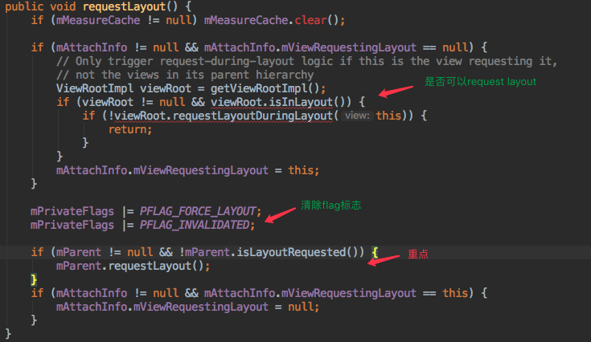

# View.Layout过程的深度分析

layout的操作是在前面measure完成之后进行的，具体可看：


具体的调用栈如下：


从上面的调用栈可以看出，布局时从DecorView开始的。然后基本就是递归的调用。

入口的方法`performLayout()`：

```java
private void performLayout(
		WindowManager.LayoutParams lp, 
		int desiredWindowWidth, 
		int desiredWindowHeight) {
	... ...
}
```

注意下它的三个参数：

* lp：当前窗口的布局参数
* desiredWindowWidth/desiredWindowHeight：当前窗口的宽高


如上面调用栈的调用新，代码debug可以看出，layout是由DecorView触发（host就是DecorView），同时带上窗口的布局信息。

## layout

`layout()`函数在View和ViewGroup都有实现，ViewGroup是对View的重写。

### ViewGroup.layout()

```java
@Override
public final void layout(int l, int t, int r, int b) {
    if (!mSuppressLayout && (mTransition == null || !mTransition.isChangingLayout())) {
        if (mTransition != null) {
            mTransition.layoutChange(this);
        }
        super.layout(l, t, r, b);
    } else {
        // record the fact that we noop'd it; request layout when transition finishes
        mLayoutCalledWhileSuppressed = true;
    }
}
```

代码逻辑很简单，就是判断是不是layout还在进行中，如果是的话则不会再进行layout操作。而layout的操作是调用View的layout()方法。

### View.layout()

`View.layout()`代码可以分为几个模块进行分析：

> 模块1：measure

```java
if ((mPrivateFlags3 & PFLAG3_MEASURE_NEEDED_BEFORE_LAYOUT) != 0) {
    onMeasure(mOldWidthMeasureSpec, mOldHeightMeasureSpec);
    mPrivateFlags3 &= ~PFLAG3_MEASURE_NEEDED_BEFORE_LAYOUT;
}
```

这个代码不一定会运行，只有在Measure没有做的情况下，这里会补下Measure的操作。**问题：什么情况下Measure没有走到？**

> 模块2：边界设置

正如[layoutmode](./layoutmode.md)介绍的关于布局显示模式的介绍，在布局的时候将确定View的布局大小和位置是否发生了改变。

```java
boolean changed = isLayoutModeOptical(mParent) ? setOpticalFrame(l, t, r, b) : setFrame(l, t, r, b);
```

对于是`opticalBounds`的情况下，边界是不一样的。`changed`返回值来表示布局的大小和位置是否发生了变化，是否需要进行新的布局。这里面的逻辑后面具体分析。

> 模块3：onLayout

如果需要进行布局，将调用onLayout。

```java
if (changed || (mPrivateFlags & PFLAG_LAYOUT_REQUIRED) == PFLAG_LAYOUT_REQUIRED) {
    onLayout(changed, l, t, r, b);
    ... ...
}
```

> 模块4：针对ware devices

```java
if (shouldDrawRoundScrollbar()) {
    if(mRoundScrollbarRenderer == null) {
        mRoundScrollbarRenderer = new RoundScrollbarRenderer(this);
    }
} else {
    mRoundScrollbarRenderer = null;
}
``` 

> 模块5：回调onLayoutChange()

```java
ListenerInfo li = mListenerInfo;
if (li != null && li.mOnLayoutChangeListeners != null) {
    ArrayList<OnLayoutChangeListener> listenersCopy =
            (ArrayList<OnLayoutChangeListener>)li.mOnLayoutChangeListeners.clone();
    int numListeners = listenersCopy.size();
    for (int i = 0; i < numListeners; ++i) {
        listenersCopy.get(i).onLayoutChange(this, l, t, r, b, oldL, oldT, oldR, oldB);
    }
}
```

### View.onLayout()

```java
protected void onLayout(
			boolean changed, 
			int left, 
			int top, 
			int right, 
			int bottom) {
}
```

是个空方法，继承的子类必须实现。参数：

* changed：是否是新的大小或位置
* left：相对于父view的左边距
* top:相对于父view的顶部边距
* right:相对于父view的右边距
* bottom:相对于父view的底部边距

### FrameLayout.onLayout()

以FrameLayout为例子来介绍下实际的布局操作。它也可以分为几个模块进行分析：

> 模块1：计算FrameLayout的padding

```java
final int parentLeft = getPaddingLeftWithForeground();
final int parentRight = right - left - getPaddingRightWithForeground();
final int parentTop = getPaddingTopWithForeground();
final int parentBottom = bottom - top - getPaddingBottomWithForeground();
```

> 模块2：循环FrameLayout下的所有子View

**注意，只有visibility不为`GONE`的才会被布局。**

> 模块3：获取子view的LayoutParams/width/height信息

```java
final LayoutParams lp = (LayoutParams) child.getLayoutParams();
final int width = child.getMeasuredWidth();
final int height = child.getMeasuredHeight();
```

> 模块4：计算Gravity

这里会计算在`水平方向`和`垂直方向`上的两个Gravity值。

```java
final int layoutDirection = getLayoutDirection();
final int absoluteGravity = Gravity.getAbsoluteGravity(gravity, layoutDirection);
final int verticalGravity = gravity & Gravity.VERTICAL_GRAVITY_MASK;
```

这里会根据传入的`gravity`值和当前的`layoutDirection`值（_这个可以看下[View.Measure过程的深度分析](./View.Measure过程的深度分析.md)_)前面的介绍）来计算的。

> 模块5：计算子view的Left、Top值

```java
switch (absoluteGravity & Gravity.HORIZONTAL_GRAVITY_MASK) {
    case Gravity.CENTER_HORIZONTAL:
        childLeft = parentLeft + (parentRight - parentLeft - width) / 2 +
        lp.leftMargin - lp.rightMargin;
        break;
    case Gravity.RIGHT:
        if (!forceLeftGravity) {
            childLeft = parentRight - width - lp.rightMargin;
            break;
        }
    case Gravity.LEFT:
    default:
        childLeft = parentLeft + lp.leftMargin;
}

switch (verticalGravity) {
    case Gravity.TOP:
        childTop = parentTop + lp.topMargin;
        break;
    case Gravity.CENTER_VERTICAL:
        childTop = parentTop + (parentBottom - parentTop - height) / 2 +
        lp.topMargin - lp.bottomMargin;
        break;
    case Gravity.BOTTOM:
        childTop = parentBottom - height - lp.bottomMargin;
        break;
    default:
        childTop = parentTop + lp.topMargin;
}
```

可以看出，主要根据gravity来，计算padding和margin的和。

> 模块6：子view调用layout

```java
child.layout(childLeft, childTop, childLeft + width, childTop + height);
```

### 补充：View.setFrame()

在`View.layout()`里调用了`View.setFrame()`，这个是干什么的呢？


这里主要是`invalidate()`方法。

> invalidate()

这个方法的意思是，使得可见的View无效，即去掉绘制的状态信息，使得进行重新绘制。

它的具体实现是在`invalidateInternal()`方法：

```java
void invalidateInternal(int l, 
			int t, 
			int r, 
			int b, 
			boolean invalidateCache,
            boolean fullInvalidate) {
}
```

了解下它的参数：

* l、t、r、b：view的边界
* invalidateCache：view的drawing cache是否也要还原？一般在fullInvalidate情况下会还原。当View的内容和尺寸没有变化时可以设置为false
* fullInvalidate：是否需要全面绘制

它的具体的代码逻辑：


在进入到`invalidateChild()`之前，先将view需要重绘的尺寸获取到，作为参数传给ViewRootImpl。

```java
@Override
public void invalidateChild(View child, Rect dirty) {
    invalidateChildInParent(null, dirty);
}

@Override
public ViewParent invalidateChildInParent(int[] location, Rect dirty) {
    checkThread();
    if (DEBUG_DRAW) Log.v(mTag, "Invalidate child: " + dirty);

    if (dirty == null) {
        invalidate();
        return null;
    } else if (dirty.isEmpty() && !mIsAnimating) {
        return null;
    }

    if (mCurScrollY != 0 || mTranslator != null) {
        mTempRect.set(dirty);
        dirty = mTempRect;
        if (mCurScrollY != 0) {
            dirty.offset(0, -mCurScrollY);
        }
        if (mTranslator != null) {
            mTranslator.translateRectInAppWindowToScreen(dirty);
        }
        if (mAttachInfo.mScalingRequired) {
            dirty.inset(-1, -1);
        }
    }

    invalidateRectOnScreen(dirty);

    return null;
}
```

这里主要是会走到`invalidateRectOnScreen()`方法：

```java
private void invalidateRectOnScreen(Rect dirty) {
    final Rect localDirty = mDirty;
    if (!localDirty.isEmpty() && !localDirty.contains(dirty)) {
        mAttachInfo.mSetIgnoreDirtyState = true;
        mAttachInfo.mIgnoreDirtyState = true;
    }

    // Add the new dirty rect to the current one
    localDirty.union(dirty.left, dirty.top, dirty.right, dirty.bottom);
    // Intersect with the bounds of the window to skip
    // updates that lie outside of the visible region
    final float appScale = mAttachInfo.mApplicationScale;
    final boolean intersected = localDirty.intersect(0, 0,
            (int) (mWidth * appScale + 0.5f), (int) (mHeight * appScale + 0.5f));
    if (!intersected) {
        localDirty.setEmpty();
    }
    if (!mWillDrawSoon && (intersected || mIsAnimating)) {
        scheduleTraversals();
    }
}
```

这里的核心就是在`scheduleTraversals()`方法，怎么说呢？**就是在清除了所有的标记和数据后，肯定还是需要进行绘制的，而这个方法就是完成重新绘制的逻辑。**

### 补充：View.requestLayout()

和`invalidate()`方法比较类似的一个方法是`requestLayout()`，它有什么差异呢？



核心的是调用了`ViewRootImpl`类中的`requestLayout()`：

```java
@Override
public void requestLayout() {
    if (!mHandlingLayoutInLayoutRequest) {
        checkThread();
        mLayoutRequested = true;
        scheduleTraversals();
    }
}
```

这里最后也是走到`scheduleTraversals()`来完成重新的绘制。

#### 关于补充部分的总结：View.requestLayout() VS View.invalidate()

最明细的差异是，requestLayout会重新走measure、layout和draw流程，而invalidate只会走draw流程。这个主要是两个阶段所给的标志位不同，在ViewRootImpl里就触发了不同的代码逻辑。

**一般的使用场景是，如果只是需要进行绘制，而不改变视图的大小和区域，则只要调用invalidate完成重新draw即可；而如果是大小或区域发生了变化，则需要调用requestLayout。** invalidate的效率比requestLayout高效很多。


> postInvalidate()?

`invalidate()`的操作是必须在UI线程发起，而`postInvalidate()`是可以从非UI线程触发，同时也可以将操作滞后。

```java
public void postInvalidateDelayed(long delayMilliseconds) {
    // We try only with the AttachInfo because there's no point in invalidating
    // if we are not attached to our window
    final AttachInfo attachInfo = mAttachInfo;
    if (attachInfo != null) {
        attachInfo.mViewRootImpl.dispatchInvalidateDelayed(this, delayMilliseconds);
    }
}

public void dispatchInvalidateDelayed(View view, long delayMilliseconds) {
    Message msg = mHandler.obtainMessage(MSG_INVALIDATE, view);
    mHandler.sendMessageDelayed(msg, delayMilliseconds);
}
```

> getViewRootImpl()

不管是invalidate()还是requestLayout()都是从当前view不断向上提交处理，最终到达DecorView处理，而最终的处理又是在`ViewRootImpl`里，而`View`和`ViewRootImpl`的关系是怎么确立的的呢：

```java
public ViewRootImpl getViewRootImpl() {
    if (mAttachInfo != null) {
        return mAttachInfo.mViewRootImpl;
    }
    return null;
}
```

### 补充：forceLayout()和requestLayout()

forceLayout()的代码：

```java
public void forceLayout() {
    if (mMeasureCache != null) mMeasureCache.clear();

    mPrivateFlags |= PFLAG_FORCE_LAYOUT;
    mPrivateFlags |= PFLAG_INVALIDATED;
}
```

**这里不会调用ViewRootImpl来触发`scheduleTraversals()`，它的作用是等待下次做layout操作时，强制view进行layout逻辑。注意这个方法不会向上提交。**

## 总结


