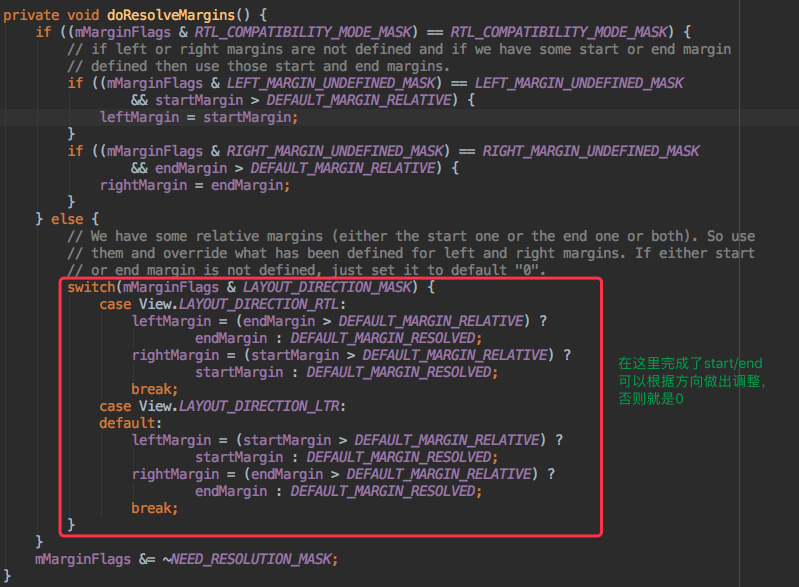

# View.Measure过程的深度分析

## ViewGroup.LayoutParams

这个是来描述view的大小以及它所处的位置信息，注意`ViewGroup`并没有设置位置的操作，这个是子View需要做的事情。

可以有如下几种方式实例化对象：

```java
public LayoutParams(int width, int height) {
     this.width = width;
     this.height = height;
}

public LayoutParams(LayoutParams source) {
     this.width = source.width;
     this.height = source.height;
}

public LayoutParams(Context c, AttributeSet attrs) {
     TypedArray a = c.obtainStyledAttributes(attrs, R.styleable.ViewGroup_Layout);
     setBaseAttributes(a,
                    R.styleable.ViewGroup_Layout_layout_width,
                    R.styleable.ViewGroup_Layout_layout_height);
     a.recycle();
}
```

### ViewGroup.MarginLayoutParams

一般的子类不是直接`ViewGroup.LayoutParams`，而是继承`ViewGroup.MarginLayoutParams`。它在`ViewGroup.LayoutParams`基础上增加了margin的数据设置，这个是很通用的功能。

> 引申阅读：`layout_marginStart`与`layout_marginLeft`的区别

要解释这个问题，需要先来了解下**屏幕方向**。

从4.2开始，支持屏幕的布局方向，支持2种方向：

* RTL：right to left
* LTR：left to right

可以修改布局是否支持RTL布局，默认是false，就是不支持，但是可以在清单文件中进行修改：

```xml
android:supportsRtl="true|false"
```

如果开启，则当用户切换到某些从右到左的的语言，或者用户直接设置`强制所有语言都是从右到左`，则整个界面将做镜像。

* 如果`targetSdkVersion`或`minSdkVersion`是大于等于17的，则在开发中应该将**XXXstart/XXXend**去替换成**XXXleft/XXXright**。
* 如果`targetSdkVersion`或`minSdkVersion`是小于17，则应该同时加上**XXXstart/XXXend**和**XXXleft/XXXright**。

**>>> 为什么呢？Why？**

因为对于LTR，则`start`、`end`正好等价于`left`、`right`，而RTL，则正好反过来，`start`对应了`right`，`end`对应了`left`。

看个图就知道原因：


正常的，转成RTL后，右边应该是有个margin的，但是实际情况却是没有。这就是因为用的不是`layout_marginStart`，而是`layout_marginLeft`导致的。

更进一步，sdk 17加了更多APIS来控制view的显示。

* `android:layoutDirection`：修改layout控件的方向，它又几个值：
 * **RTL**
 * **LTR**
 * **INHERIT**：继承？
 * **LOCALE**：跟随本地系统，当前语言的屏幕方向
 * 它跟`android:supportsRtl`的不同：（只有布局发生了变化，其他如actionbar都没变）
* `android:textDirection`：文本的方向，它又几个值，具体看[http://developer.android.com/reference/android/view/View.html#attr_android:textDirection](http://developer.android.com/reference/android/view/View.html#attr_android:textDirection)
* `android:textAlignment`：文本对齐的方式，它的值很多，具体看[http://developer.android.com/reference/android/view/View.html#attr_android:textAlignment](http://developer.android.com/reference/android/view/View.html#attr_android:textAlignment)
* `getLayoutDirectionFromLocale()`：获取布局方向，这个是`TextUtils`类里的静态方法

> `LayoutParams`如何去解析`start`和`end`的呢？

在`ViewGroup.LayoutParams`定义了一个方法（空方法）：

```java
// 根据布局方向解析布局的参数，关心布局方向的子类应该重写这个方法
public void resolveLayoutDirection(int layoutDirection) {
}
```

在`ViewGroup.MarginLayoutParams`重写了：

```java
@Override
public void resolveLayoutDirection(int layoutDirection) {
    setLayoutDirection(layoutDirection);

    // No relative margin or pre JB-MR1 case or no need to resolve, just dont do anything
    // Will use the left and right margins if no relative margin is defined.
    if (!isMarginRelative() ||
            (mMarginFlags & NEED_RESOLUTION_MASK) != NEED_RESOLUTION_MASK) return;

    // Proceed with resolution
    doResolveMargins();
}
```

在如下情况下不用解析right/left margin：

1. 是否是相对布局，设置了才去解析

  ```java
  public boolean isMarginRelative() {
     return (startMargin != DEFAULT_MARGIN_RELATIVE || endMargin != DEFAULT_MARGIN_RELATIVE);
  }
  ```
2. JB-MR1之前的不用解析
3. `(mMarginFlags & NEED_RESOLUTION_MASK) != NEED_RESOLUTION_MASK`

否则，进入解析阶段：



> 扩展阅读：AndroidManifest合并

在修改上面的`android:supportsRtl`值的时候，出现了下面的编译错误：


我们知道，包含多个`AndroidManifest`文件的工程，在构建成APK时，会合并成一个`AndroidManifest`文件，而上面的编译问题其实是多个module打包同样的属性设置了不同的值导致的冲突。

具体请看：[http://mouxuejie.com/blog/2016-02-05/androidmanifest-merge/](http://mouxuejie.com/blog/2016-02-05/androidmanifest-merge/)

## View.MeasureSpec

MeasureSpec是父控件用来控制子控件的大小，它将作为参数传递给view，但是具体的计算还是又View自己说了算。

> MeasureSpec的结构

MeasureSpec是由mode和size组合的：


mode的类型：

* `UNSPECIFIED（00）`：就是未指定。父控件不对子控件做约束，子控件的大小完全可以由自己决定
* `EXACTLY（01）`：精确匹配。父控件完全控制子控件的大小，希望子控件按照自己的尺寸来显示。其实这个值是父控件根据自己的MeasureSpec和子控件的布局参数来计算得到的
 * 具体值
 * match_parent 
* `AT_MOST（02）`：最大模式。父控件将为子控件指定出最大的参考尺寸，在这个尺寸内都是可以接受的，子控件的大小随着内容进行变化，这种模式也是父控件根据自身的MeasureSpec跟子View的布局参数来确定的
 * wrap_content 

核心API：

* `getMode(int measureSpec)`：根据measureSpec得到mode的值
* `getSize(int measureSpec)`：根据measureSpec得到size的值
* `makeMeasureSpec`：根据size和mode构造出MeasureSpec值

  ```java
  public static int makeMeasureSpec(@IntRange(from = 0, to = (1 << MeasureSpec.MODE_SHIFT) - 1) int size,
                                          @MeasureSpecMode int mode) {
            if (sUseBrokenMakeMeasureSpec) {
                return size + mode;
            } else {
                return (size & ~MODE_MASK) | (mode & MODE_MASK);
            }
        }
  ```
  
  这里有2个方式，在api17以前就是size+mode的计算方式，但是api17之后采用了&|的计算方式，效率更高些。
  
## 系统的Measure过程分析

所有的过程都是从`ViewRootImpl.performTraversals()`中开始的，这个方法里完成了view的所有过程，所以我们只需要关注measure的代码部分：


### 什么情况下要measure？

从代码可以看出，measure逻辑并不是必须的，它的条件是（满足其一）：

* `mStopped`：window是否还在活跃的状态，不活跃（active）的情况下不需要measure，不活跃则`mStopped`为true值
* `mReportNextDraw`：需要进行下一次的绘制
* `focusChangedDueToTouchMode`：由于touch事件导致的焦点变化
* `mWidth != host.getMeasuredWidth() || mHeight != host.getMeasuredHeight()`：当窗口的宽高不等于view的宽高时？？？
* `updatedConfiguration`：configuration发生了变化，变化了就是为true值
* `contentInsetsChanged`：这个跟Insets标签有关吧？？？

### （必须）第一次measure

这里的`mWidth`是窗口的宽度，`mHeight`是窗口的高度（具体的是在`MSG_RESIZED_REPORT`消息里处理的）；

`lp`是窗口的布局参数`new WindowManager.LayoutParams()`

在第一次measure的时候，其实是获取root节点（DecorView）的measure spec的值，这个值将在测量所有子控件的限制。具体的逻辑是：

```java
private static int getRootMeasureSpec(int windowSize, int rootDimension) {
        int measureSpec;
        switch (rootDimension) {

        case ViewGroup.LayoutParams.MATCH_PARENT:
            // Window can't resize. Force root view to be windowSize.
            measureSpec = MeasureSpec.makeMeasureSpec(windowSize, MeasureSpec.EXACTLY);
            break;
        case ViewGroup.LayoutParams.WRAP_CONTENT:
            // Window can resize. Set max size for root view.
            measureSpec = MeasureSpec.makeMeasureSpec(windowSize, MeasureSpec.AT_MOST);
            break;
        default:
            // Window wants to be an exact size. Force root view to be that size.
            measureSpec = MeasureSpec.makeMeasureSpec(rootDimension, MeasureSpec.EXACTLY);
            break;
        }
        return measureSpec;
    }
```

传入的参数是`窗口的宽/高值`和`布局的方式`。可以看出：

* 布局参数为MATCH_PARENT的情况下，就采用精确模式，view的大小就是窗口的大小
* 布局参数为WRAP_CONTENT的情况下，就采用最大模式，view的大小不会超过窗口的大小
* 布局参数为具体值的情况下，就采用精确模式，view的大小就是这个值的大小

### （非必须）第二次measure

这次的测量可以理解为对第一次测量的修正。主要是看`WindowManager.LayoutParams.horizontalWeight`和`WindowManager.LayoutParams.verticalWeight`的值来决定是否要修正，这2个值的意思是

### performMeasure

完成了上面的操作，就进入到了decorview下的子控件的measure：

```java
private void performMeasure(int childWidthMeasureSpec, int childHeightMeasureSpec) {
        if (mView == null) {
            return;
        }
        Trace.traceBegin(Trace.TRACE_TAG_VIEW, "measure");
        try {
            mView.measure(childWidthMeasureSpec, childHeightMeasureSpec);
        } finally {
            Trace.traceEnd(Trace.TRACE_TAG_VIEW);
        }
    }
```

它这里就是调用root view的`measure()`方法。`measure()`方法不是核心所在，主要是有个缓存的逻辑，实际的还是`View.onMeasure()`

但是实际的`onMeasure()`又要分ViewGroup和View，这2个的测绘是不一样的。

* ViewGroup.onMeasure()
* View.onMeasure()

#### FrameLayout.onMeasure()

FrameLayout是布局中相对来说简单点的，所以用FrameLayout来分析ViewGroup的measure逻辑。

> 1、对每个子view进行测量

```java
int count = getChildCount();

for (int i = 0; i < count; i++) {
    final View child = getChildAt(i);
    if (mMeasureAllChildren || child.getVisibility() != GONE) {
        measureChildWithMargins(child, widthMeasureSpec, 0, heightMeasureSpec, 0);
        ... ...
    }
}
```

可以看出，对FrameLayout里的所有visibility属性不为GONE的子View都进行测量，具体调用的是`measureChildWithMargins()`方法：

```java
protected void measureChildWithMargins(View child,
        int parentWidthMeasureSpec, int widthUsed,
        int parentHeightMeasureSpec, int heightUsed) {
    final MarginLayoutParams lp = (MarginLayoutParams) child.getLayoutParams();

    final int childWidthMeasureSpec = getChildMeasureSpec(parentWidthMeasureSpec,
            mPaddingLeft + mPaddingRight + lp.leftMargin + lp.rightMargin
                    + widthUsed, lp.width);
    final int childHeightMeasureSpec = getChildMeasureSpec(parentHeightMeasureSpec,
            mPaddingTop + mPaddingBottom + lp.topMargin + lp.bottomMargin
                    + heightUsed, lp.height);

    child.measure(childWidthMeasureSpec, childHeightMeasureSpec);
}
```

它的参数：

* child：需要被测量的view
* parentWidthMeasureSpec：父view测量的measure spec值，决定了子view的显示方式+宽度限制
* widthUsed：被使用掉了的width空间（可能是其他子View，需要减去）
* parentHeightMeasureSpec：父view测量的measure spec值，决定了子view的显示方式+高度限制
* heightUsed：被使用掉了的height空间（可能是其他子View，需要减去）

测量子view需要考虑parent的MeasureSpec值，同时还要考虑padding和margin，通过调用`getChildMeasureSpec()`来得到子view的MeasureSpec：

```java
public static int getChildMeasureSpec(int spec, int padding, int childDimension) {
    int specMode = MeasureSpec.getMode(spec);
    int specSize = MeasureSpec.getSize(spec);

    int size = Math.max(0, specSize - padding);

    int resultSize = 0;
    int resultMode = 0;

    switch (specMode) {
    // Parent has imposed an exact size on us
    case MeasureSpec.EXACTLY:
        if (childDimension >= 0) {
            resultSize = childDimension;
            resultMode = MeasureSpec.EXACTLY;
        } else if (childDimension == LayoutParams.MATCH_PARENT) {
            // Child wants to be our size. So be it.
            resultSize = size;
            resultMode = MeasureSpec.EXACTLY;
        } else if (childDimension == LayoutParams.WRAP_CONTENT) {
            // Child wants to determine its own size. It can't be
            // bigger than us.
            resultSize = size;
            resultMode = MeasureSpec.AT_MOST;
        }
        break;

    // Parent has imposed a maximum size on us
    case MeasureSpec.AT_MOST:
        if (childDimension >= 0) {
            // Child wants a specific size... so be it
            resultSize = childDimension;
            resultMode = MeasureSpec.EXACTLY;
        } else if (childDimension == LayoutParams.MATCH_PARENT) {
            // Child wants to be our size, but our size is not fixed.
            // Constrain child to not be bigger than us.
            resultSize = size;
            resultMode = MeasureSpec.AT_MOST;
        } else if (childDimension == LayoutParams.WRAP_CONTENT) {
            // Child wants to determine its own size. It can't be
            // bigger than us.
            resultSize = size;
            resultMode = MeasureSpec.AT_MOST;
        }
        break;

    // Parent asked to see how big we want to be
    case MeasureSpec.UNSPECIFIED:
        if (childDimension >= 0) {
            // Child wants a specific size... let him have it
            resultSize = childDimension;
            resultMode = MeasureSpec.EXACTLY;
        } else if (childDimension == LayoutParams.MATCH_PARENT) {
            // Child wants to be our size... find out how big it should
            // be
            resultSize = View.sUseZeroUnspecifiedMeasureSpec ? 0 : size;
            resultMode = MeasureSpec.UNSPECIFIED;
        } else if (childDimension == LayoutParams.WRAP_CONTENT) {
            // Child wants to determine its own size.... find out how
            // big it should be
            resultSize = View.sUseZeroUnspecifiedMeasureSpec ? 0 : size;
            resultMode = MeasureSpec.UNSPECIFIED;
        }
        break;
    }
    //noinspection ResourceType
    return MeasureSpec.makeMeasureSpec(resultSize, resultMode);
}
```

注意它的参数：

* spec：父view测量的measure spec值，决定了子view的显示方式+大小限制
* padding：padding+margin+被其他view所used掉的值
* childDimension：view实际希望的显示的大小，即子View布局定义的宽高（`MATCH_PARENT`、`WRAP_CONTENT`、具体值）

下面整理下整个计算的过程：


这个完成之后，就调用`View.measure()`了。这个后面分析。

**这里为什么是for循环，并且是重新赋值？？？**


道理很明显，因为FrameLayout是覆盖的，这里不停的循环计算，就是为了找到最大的子View的宽度和高度。以最大的宽高作为FrameLayout的尺寸。

> 2、容器的大小计算，并保存

上面测量了所有子view中最大的宽高值，但是这个也不一定就是最大的，还有一些处理：

```java
// Account for padding too
maxWidth += getPaddingLeftWithForeground() + getPaddingRightWithForeground();
maxHeight += getPaddingTopWithForeground() + getPaddingBottomWithForeground();

// Check against our minimum height and width
maxHeight = Math.max(maxHeight, getSuggestedMinimumHeight());
maxWidth = Math.max(maxWidth, getSuggestedMinimumWidth());

// Check against our foreground's minimum height and width
final Drawable drawable = getForeground();
if (drawable != null) {
    maxHeight = Math.max(maxHeight, drawable.getMinimumHeight());
    maxWidth = Math.max(maxWidth, drawable.getMinimumWidth());
}
```

这里有三点考虑：

* 增加padding的值
* max和suggestedMinimum，选择较大的
* 有前景Drawable，则max和drawable minimum，选择较大的

具体保存的逻辑比较简单：

```java
protected final void setMeasuredDimension(int measuredWidth, int measuredHeight) {
   boolean optical = isLayoutModeOptical(this);
   if (optical != isLayoutModeOptical(mParent)) {
       Insets insets = getOpticalInsets();
       int opticalWidth  = insets.left + insets.right;
       int opticalHeight = insets.top  + insets.bottom;

       measuredWidth  += optical ? opticalWidth  : -opticalWidth;
       measuredHeight += optical ? opticalHeight : -opticalHeight;
   }
   setMeasuredDimensionRaw(measuredWidth, measuredHeight);
}

private void setMeasuredDimensionRaw(int measuredWidth, int measuredHeight) {
    mMeasuredWidth = measuredWidth;
    mMeasuredHeight = measuredHeight;

    mPrivateFlags |= PFLAG_MEASURED_DIMENSION_SET;
}
```

可以看出，保存的代码其实没啥逻辑，就是讲前面计算的值存到`mMeasuredWidth`和`mMeasuredHeight`里而已。

**关于`Optical Bounds`**

上面的`setMeasuredDimension()`函数，一开始会判断下是layoutMode的值。layoutmode的不同，measuredWidth/measureHeight会做相应的调整。具体请看：[layoutmode](./layoutmode.md)

> 3、对部分子view的“矫正”

**“矫正”是什么意思呢？为什么要走这一步呢？**

我们先看看走这一步的前提条件：

```java
... ...
final boolean measureMatchParentChildren =
        MeasureSpec.getMode(widthMeasureSpec) != MeasureSpec.EXACTLY ||
        MeasureSpec.getMode(heightMeasureSpec) != MeasureSpec.EXACTLY;
        
... ...
        
for (int i = 0; i < count; i++) {
    final View child = getChildAt(i);
    if (mMeasureAllChildren || child.getVisibility() != GONE) {
      	... ...
        if (measureMatchParentChildren) {
            if (lp.width == LayoutParams.MATCH_PARENT ||
                    lp.height == LayoutParams.MATCH_PARENT) {
                mMatchParentChildren.add(child);
            }
        }
    }
}

... ...

count = mMatchParentChildren.size();
if (count > 1) {
	... ...
	child.measure(childWidthMeasureSpec, childHeightMeasureSpec);
}
```

可以看出，要走“矫正”的逻辑，需要满足2个条件：

1. FrameLayout的宽高设置为`WRAP_CONTENT`
2. 在满足条件1的清理下，FrameLayout有大于1个子view的宽高设置为`MATCH_PARENT`

“矫正”是因为在一开始计算后，FrameLayout的尺寸又有了变化，在`WRAP_CONTENT`的情况下，就需要重新计算子view的大小了。

#### View.onMeasure()

系统为我们提供了View默认的测量的逻辑：

```java
protected void onMeasure(int widthMeasureSpec, int heightMeasureSpec) {
    setMeasuredDimension(getDefaultSize(getSuggestedMinimumWidth(), widthMeasureSpec),
            getDefaultSize(getSuggestedMinimumHeight(), heightMeasureSpec));
}
```

这里主要是`getDefaultSize()`方法：

```java
public static int getDefaultSize(int size, int measureSpec) {
    int result = size;
    int specMode = MeasureSpec.getMode(measureSpec);
    int specSize = MeasureSpec.getSize(measureSpec);

    switch (specMode) {
    case MeasureSpec.UNSPECIFIED:
        result = size;
        break;
    case MeasureSpec.AT_MOST:
    case MeasureSpec.EXACTLY:
        result = specSize;
        break;
    }
    return result;
}
```

它的参数：

* size：建议的最小尺寸（宽/高）
* measureSpec：父类对view的限制

在`UNSPECIFIED`的情况下，用最小的尺寸，在其他情况下，则用父类的大小。

总结，整个的Measure流程可以整理为：


## 扩展知识

[延迟处理Handler](./延迟处理Handler.md)