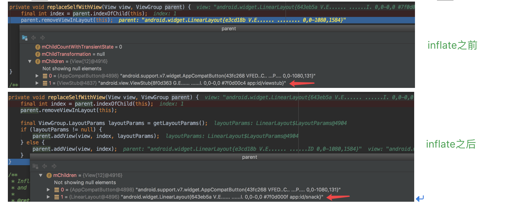
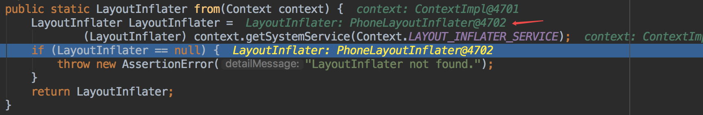

# ViewStub

这个是个延时加载的布局标签，只有通过`ViewStub.inflate()`或者`View.setVisibility()`才会触发布局的真正展开和绘制。

**这个的优势是，可以不去渲染此刻不需要展现的视图，在真正需要的时候才去展示，从而节省资源，加快实际需要展示视图的展现速度。**

## 具体使用

定义xml文件：

```java
<ViewStub
    android:id="@+id/viewstub"
    android:inflatedId="@+id/XXX" 
    android:layout="@layout/XXX"
    android:layout_width="match_parent"
    android:layout_height="match_parent"/>
```

使用的代码：

```java
((ViewStub)findViewById(R.id.viewstub)).inflate();

或者

((ViewStub)findViewById(R.id.viewstub)).setVisibility(View.VISIBLE);
```

## 原理分析

```java
public final class ViewStub extends View
```

可以看出，`ViewStub`是继承自View的一种特殊的视图，**他的特殊是零大小，不绘制的视图，更轻量级的View**，从代码上就能看出：

```java
@Override
protected void onMeasure(int widthMeasureSpec, int heightMeasureSpec) {
    setMeasuredDimension(0, 0);
}

@Override
public void draw(Canvas canvas) {
}

@Override
protected void dispatchDraw(Canvas canvas) {
}
```

可以看出，ViewStub的宽高都是0，并且不做绘制，也不降绘制分发给子View。

> 初始化&实例化

```java
public ViewStub(Context context, AttributeSet attrs, int defStyleAttr, int defStyleRes) {
    super(context);

    final TypedArray a = context.obtainStyledAttributes(attrs,
            R.styleable.ViewStub, defStyleAttr, defStyleRes);
    mInflatedId = a.getResourceId(R.styleable.ViewStub_inflatedId, NO_ID);
    mLayoutResource = a.getResourceId(R.styleable.ViewStub_layout, 0);
    mID = a.getResourceId(R.styleable.ViewStub_id, NO_ID);
    a.recycle();

    setVisibility(GONE);
    setWillNotDraw(true);
}
```

很简单的代码，主要是解析`inflateId`和`layout`。这里注意下`setWillNotDraw()`这个方法。

```java
public void setWillNotDraw(boolean willNotDraw) {
    setFlags(willNotDraw ? WILL_NOT_DRAW : 0, DRAW_MASK);
}
```

这个是在当view不需要进行任何的绘制的时候，设置成这个flag，可以进一步优化。那有什么优化呢？？

可以看看在哪些地方使用到了`WILL_NOT_DRAW`标签，地方有：

* setDefaultFocusHighlight
* setBackgroundDrawable
* setForeground

在这里都会判断是否是`WILL_NOT_DRAW`，如果是则将设置：

```java
mPrivateFlags |= PFLAG_SKIP_DRAW;
```

在`draw()`里，可以看到有这么一段代码：

```java
// Fast path for layouts with no backgrounds
if ((mPrivateFlags & PFLAG_SKIP_DRAW) == PFLAG_SKIP_DRAW) {
    mPrivateFlags &= ~PFLAG_DIRTY_MASK;
    dispatchDraw(canvas);
} else {
    draw(canvas);
}
```

可以看出，这里的优化是不做该view的draw的逻辑。

> infate操作

```java
public View inflate() {
    final ViewParent viewParent = getParent();

    if (viewParent != null && viewParent instanceof ViewGroup) {
        if (mLayoutResource != 0) {
            final ViewGroup parent = (ViewGroup) viewParent;
            final View view = inflateViewNoAdd(parent);
            replaceSelfWithView(view, parent);

            mInflatedViewRef = new WeakReference<>(view);
            if (mInflateListener != null) {
                mInflateListener.onInflate(this, view);
            }

            return view;
        } else {
            throw new IllegalArgumentException("ViewStub must have a valid layoutResource");
        }
    } else {
        throw new IllegalStateException("ViewStub must have a non-null ViewGroup viewParent");
    }
}
```

首先调用`getParent()`来获取parent view，如果不为空并且是ViewGroup的话，则展开ViewStub，主要的逻辑是在`inflateViewNoAdd()`里：

```java
private View inflateViewNoAdd(ViewGroup parent) {
    final LayoutInflater factory;
    if (mInflater != null) {
        factory = mInflater;
    } else {
        factory = LayoutInflater.from(mContext);
    }
    final View view = factory.inflate(mLayoutResource, parent, false);

    if (mInflatedId != NO_ID) {
        view.setId(mInflatedId);
    }
    return view;
}
```

这里需要注意的是`LayoutInflater`这个对象怎么来的。

1. 来自全局`mInflater`变量，

  ```java
  public void setLayoutInflater(LayoutInflater inflater) {
        mInflater = inflater;
    }
  ```
  
  这个是在什么地方调用的呢？这个其实是在`LayoutInflater.createView()`里调用的：
  
  ```java
if (view instanceof ViewStub) {
        // Use the same context when inflating ViewStub later.
        final ViewStub viewStub = (ViewStub) view;
        viewStub.setLayoutInflater(cloneInContext((Context) args[0]));
    }
  ```
  
  可以看到LayoutInflater在inflate布局文件的时候，会判断是不是ViewStub，这里会将同context的LayoutInflater传给ViewStub。具体请看后面的**延展阅读。**
2. 自己根据当前ViewStub的context构建出新的LayoutInflater

完成了上面的处理后，**需要将展开的视图替换成原来的ViewStub**，看下图：



具体的代码是在`replaceSelfWithView()`里：

```java
private void replaceSelfWithView(View view, ViewGroup parent) {
    final int index = parent.indexOfChild(this);
    parent.removeViewInLayout(this);

    final ViewGroup.LayoutParams layoutParams = getLayoutParams();
    if (layoutParams != null) {
        parent.addView(view, index, layoutParams);
    } else {
        parent.addView(view, index);
    }
}
```

> 关于android:inflatedId

这个的作用其实很简单，在ViewStub被真实的view所替代后，`android:inflatedId`可以直接作为实际视图的根view的id值。

当然也可以通过代码设置：

```java
// 在inflate之前进行设置
public void setInflatedId(@IdRes int inflatedId) {
    mInflatedId = inflatedId;
}

// 获取
public int getInflatedId() {
    return mInflatedId;
}
```

## 注意事项

#### 1、注意inflate操作

ViewStub只能inflate一次，否则会直接报错：

```xml
ViewStub must have a non-null ViewGroup viewParent
```

这个是为什么呢？从上面的分析就能看出，在将ViewStub替换成真实视图前，将ViewStub从父view中剔除掉了，那么如果再inflate，则`getParent()`就为null，根据上面inflate的源码可以看出，直接抛出了异常。

#### 2、关于LayoutParams的重用

ViewStub标签的所有`android:layout_`打头的属性，在完成inflate后将直接作用于根视图，这个在上面的源码中也有体现，大家可以看`replaceSelfWithView()`：

```java
final ViewGroup.LayoutParams layoutParams = getLayoutParams();
parent.addView(view, index, layoutParams);
```

#### 3、ViewStub所要替代的layout文件中不能有`<merge>`标签

## 延展阅读

上面说到LayoutInflater的`setLayoutInflater()`，这里有个`cloneInContext()`方法，这个方法是抽象方法：

```java
public abstract LayoutInflater cloneInContext(Context newContext);
```

那它的实现类是谁呢？debug看下：



就是`PhoneLayoutInflater`，它的整个类其实很简答：

```java
package com.android.internal.policy;

import android.content.Context;
import android.util.AttributeSet;
import android.view.LayoutInflater;
import android.view.View;

/**
 * @hide
 */
public class PhoneLayoutInflater extends LayoutInflater {
    private static final String[] sClassPrefixList = {
        "android.widget.",
        "android.webkit.",
        "android.app."
    };

    /**
     * Instead of instantiating directly, you should retrieve an instance
     * through {@link Context#getSystemService}
     *
     * @param context The Context in which in which to find resources and other
     *                application-specific things.
     *
     * @see Context#getSystemService
     */
    public PhoneLayoutInflater(Context context) {
        super(context);
    }

    protected PhoneLayoutInflater(LayoutInflater original, Context newContext) {
        super(original, newContext);
    }

    /** Override onCreateView to instantiate names that correspond to the
        widgets known to the Widget factory. If we don't find a match,
        call through to our super class.
    */
    @Override protected View onCreateView(String name, AttributeSet attrs) throws ClassNotFoundException {
        for (String prefix : sClassPrefixList) {
            try {
                View view = createView(name, prefix, attrs);
                if (view != null) {
                    return view;
                }
            } catch (ClassNotFoundException e) {
                // In this case we want to let the base class take a crack
                // at it.
            }
        }

        return super.onCreateView(name, attrs);
    }

    public LayoutInflater cloneInContext(Context newContext) {
        return new PhoneLayoutInflater(this, newContext);
    }
}
```

LayoutInflater还有个实现类`AsyncLayoutInflater`，它完成异步加载视图的功能，这个具体见：[AsyncLayoutInflater分析](.AsyncLayoutInflater分析.md)

