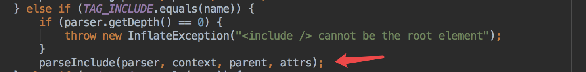
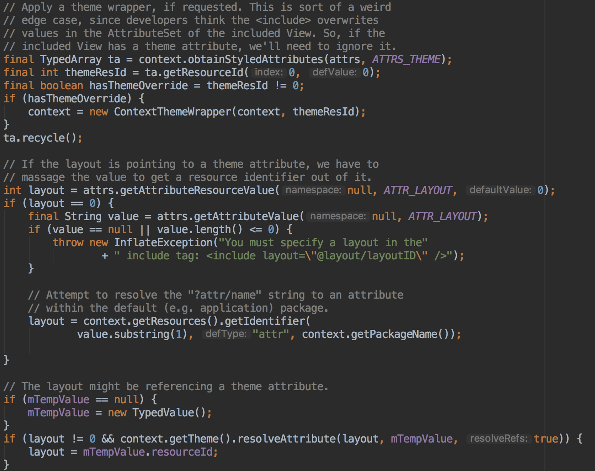
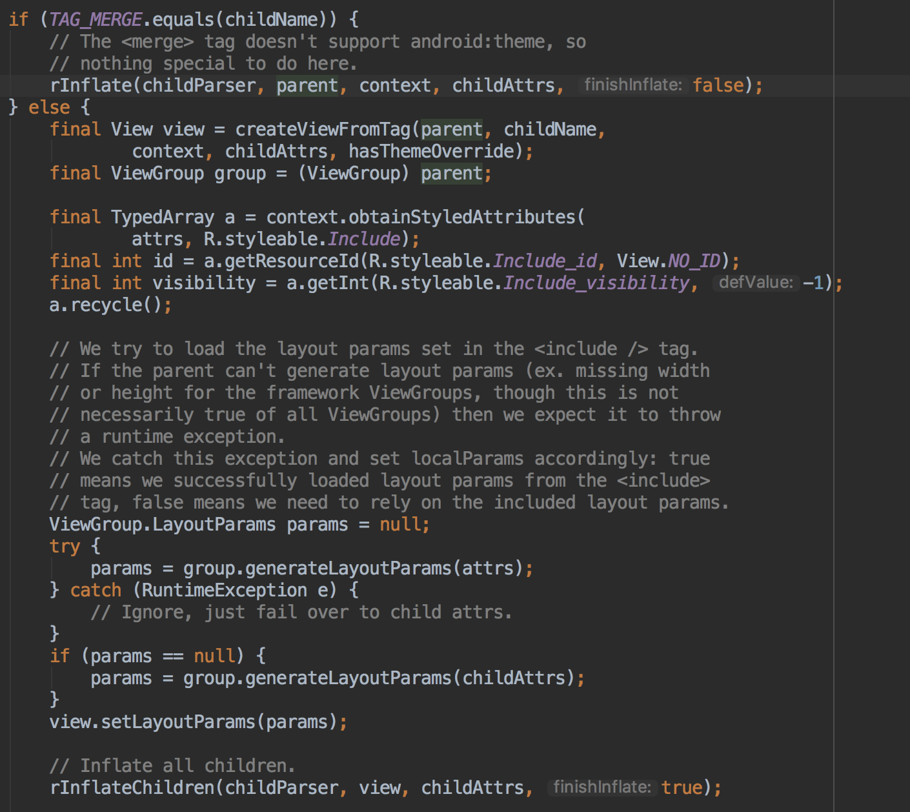
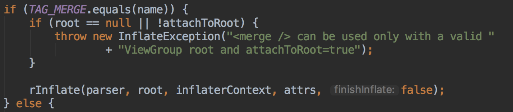

# include和merge

`<include>`和`<merge>`标签一般会配合起来使用，他们的作用分别是：

* `<include>`：通过导入其他的layout布局，来实现方便的复用
* `<merge>`：上面`<include>`标签可以导入一个布局，但是会额外增加一层的布局，而通过`<merge>`可以将这层布局剔除掉

## 具体使用

定义content view的布局：

```xml
<?xml version="1.0" encoding="utf-8"?>
<LinearLayout xmlns:android="http://schemas.android.com/apk/res/android"
              android:layout_width="match_parent"
              android:orientation="vertical"
              android:layout_height="match_parent">

    <include layout="@layout/t1" />

</LinearLayout>
```

定义include的布局：

```java
<?xml version="1.0" encoding="utf-8"?>
<merge xmlns:android="http://schemas.android.com/apk/res/android"
              android:layout_width="match_parent"
              android:layout_height="match_parent"
              android:orientation="vertical">

    <Button
        android:layout_width="match_parent"
        android:layout_height="30dp"/>

    <Button
        android:layout_width="match_parent"
        android:layout_height="30dp"/>

</merge>
```

## 原理分析

可以看到，使用起来并没有什么难度。但是它是怎么解析的呢，我们可以从`LayoutInflater.infalte()`来找到答案。

而真正完成操作的是`rInflate()`方法，具体看：



就是会看看当前的xml解析的标签是不是`<include>`，是的话则进入`parseInclude()`方法里。

> step 1：获取layout的id



id从下面几个方面尝试获取：

1. 直接从`layout="@layout/XXX"`里去解析
2. 1)失败，从attr获取
3. 从TypedValue获取

> step 2：打开include



首先判断include进来的视图是不是`merge`作为根节点的。

* `是`：以include进来`merge`视图的view（即parent）作为父view进行include视图的展开操作，调用`rInflate()`
* `否`：首先实例化被include视图的root节点，然后以该root节点为作为父view进行include视图的展开操作，调用`rInflateChildren()`

`rInflateChildren()`是什么样子的：

```java
final void rInflateChildren(XmlPullParser parser, View parent, AttributeSet attrs,
        boolean finishInflate) throws XmlPullParserException, IOException {
    rInflate(parser, parent, parent.getContext(), attrs, finishInflate);
}
```

可以看出也是调用`rInflate()`方法，**唯一的处理就是采用了当前root view的context，而不是用外层view的context**

### 更多关于merge

* merge只能作为布局的根节点来使用，因此它可以直接通过调用`LayoutInflater.infalte()`来使用，但是它必须由个父容器，否则会报错，具体可看：

 
 
* merge在使用上并不是很灵活，**因为它其实并不是布局，只是一个flag**，所以它的展现完全就依赖了引入方采用什么布局，而有时这并不是我们希望的

### 扩展阅读


