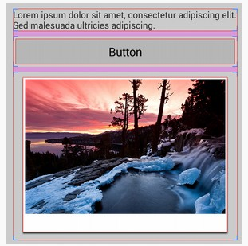
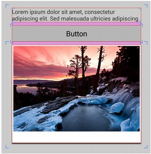

# android:layoutMode

这个是从SDK 18开始支持的。用来**设置ViewGroup布局的对齐的基准。**

它有2个值：

* **clipBounds**：默认值。使用控件边界布局容器
* **opticalBounds**：使用视觉边界布局容器

这个有什么作用呢？

**对于有些控件（如图片），可能会有透明空白边，而layoutMode的作用就是为了保证控件内容的对齐，而不是控件本身的对齐。也就是说，把那些透明的空白边，我们并看不到，真正能看到的是其内容。**

盗用网上的图：

1. 采用控件边界布局容器

 

2. 采用视觉边界布局容器

 
 
可以看到，采用视觉边界布局的跟其他控件更加对齐。