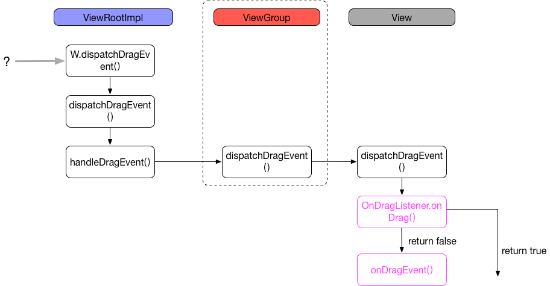

# 多窗口模式

## 前提条件

必须是android N及以上的设备，并且是支持分屏的。

## 效果


## 切换到多窗口的方式

* 长按Overview按钮，这时屏幕的一部分显示当前可分屏的activity，另外一部分显示Overview屏幕，在Overview屏幕可以选择另外的一个可共享屏幕的activity
* 段按Overview按钮，进图Overview屏幕，然后长按要分屏的activity的标题块，则可以可以拖动该Activity至屏幕突出显示的区域，使Activity进入多窗口模式。

## 多窗口的配置

我们可以在清单文件中设置属性，包括是否开启、控制大小和布局。

> android:resizeableActivity

在清单的`<activity>`或`<application>`节点中设置该属性，启用或禁用多窗口显示。

在fasle的情况下，将不支持多窗口模式，尝试启动将以全屏的方式显示。

**该值默认值为true**

> android:supportsPictureInPicture

这个是个画中画的设置，在清单文件的`<activity>`节点中设置该属性，指明Activity是否支持画中画显示。 如果android:resizeableActivity为false，将忽略该属性。 

**该值默认值为true。并且画中画模式必须是在android:resizeableActivity=true的情况下才能生效。**

> 布局属性

在`<activity>`标签下的`<layout>`标签可以设置多窗口模式下单个窗口的布局。

* `android:defaultWidth`：默认的宽度
* `android:minimalWidth`：分屏的最小宽度
* `android:defaultHeight`：默认的高度
* `android:minimalHeight `：分屏的最小宽度
* `android:gravity`：初始的位置

## 多窗口Activity的生命周期

多窗口的生命期没有破坏正常Activity的生命周期。

多窗口的生命期中新增了回调：

```java
// Called by the system when the activity changes from fullscreen mode to multi-window mode and visa-versa.
public void onMultiWindowModeChanged(boolean isInMultiWindowMode)
```

画中画也有专门的一个回调（它其实是多窗口的一种特殊形式）：

```java
// Called by the system when the activity changes to and from picture-in-picture mode.
public void onPictureInPictureModeChanged(boolean isInPictureInPictureMode)
```

下面我们根据各种场景分析下生命周期的调用：

> 场景1：进入多窗口

```xml
06-22 16:01:01.026 6115-6115/com.wx.multiwindow E/111: onMultiWindowModeChanged: true FirstActivity
06-22 16:01:01.044 6115-6115/com.wx.multiwindow E/111: onPause FirstActivity
06-22 16:01:01.278 6115-6115/com.wx.multiwindow E/111: onSaveInstanceState FirstActivity
06-22 16:01:01.288 6115-6115/com.wx.multiwindow E/111: onStop FirstActivity
06-22 16:01:01.295 6115-6115/com.wx.multiwindow E/111: onDestroy FirstActivity
06-22 16:01:01.312 6115-6115/com.wx.multiwindow E/111: onCreate FirstActivity
06-22 16:01:01.373 6115-6115/com.wx.multiwindow E/111: onStart FirstActivity
06-22 16:01:01.373 6115-6115/com.wx.multiwindow E/111: onRestoreInstanceState FirstActivity
06-22 16:01:01.379 6115-6115/com.wx.multiwindow E/111: onResume FirstActivity
06-22 16:01:01.382 6115-6115/com.wx.multiwindow E/111: onPause FirstActivity
```

可以看到，进入多窗口时，马上就会触发`onMultiWindowModeChanged`回调，然后会将activity销毁，最后再构建出来。这样的问题出现了，页面的状态进入多窗口就被销毁了。

**PS：注意这里最后当前窗口是`onPause`状态。**

**所以需要开发人员进行页面状态的保存于回复。**

> 场景2：退出多窗口

```java
06-22 16:05:47.288 6115-6115/com.wx.multiwindow E/111: onPause FirstActivity
06-22 16:05:47.504 6115-6115/com.wx.multiwindow E/111: onSaveInstanceState FirstActivity
06-22 16:05:47.512 6115-6115/com.wx.multiwindow E/111: onStop FirstActivity
06-22 16:05:47.532 6115-6115/com.wx.multiwindow E/111: onDestroy FirstActivity
06-22 16:05:47.541 6115-6115/com.wx.multiwindow E/111: onCreate FirstActivity
06-22 16:05:47.601 6115-6115/com.wx.multiwindow E/111: onStart FirstActivity
06-22 16:05:47.601 6115-6115/com.wx.multiwindow E/111: onRestoreInstanceState FirstActivity
06-22 16:05:47.611 6115-6115/com.wx.multiwindow E/111: onResume FirstActivity
06-22 16:05:47.617 6115-6115/com.wx.multiwindow E/111: onPause FirstActivity
06-22 16:05:47.768 6115-6115/com.wx.multiwindow E/111: onMultiWindowModeChanged: false FirstActivity
06-22 16:05:47.827 6115-6115/com.wx.multiwindow E/111: onResume FirstActivity
```

可以看出，退出多窗口时，先保存状态，然后销毁，然后重新构建，最后调用`onMultiWindowModeChanged`回调。

**比较奇怪的是怎么会是`onResume` -> `onPause` -> `onResume`???**

> 场景3：在多窗口模式中启动新Activity

```java
06-22 16:48:38.250 9067-9067/com.wx.multiwindow E/111: onResume FirstActivity
06-22 16:48:38.345 9067-9067/com.wx.multiwindow E/111: onPause FirstActivity
06-22 16:48:38.381 9067-9067/com.wx.multiwindow E/111: onCreate SecondActivity
06-22 16:48:38.427 9067-9067/com.wx.multiwindow E/111: onStart SecondActivity
06-22 16:48:38.433 9067-9067/com.wx.multiwindow E/111: onResume SecondActivity
```

可以看出，这里的生命周期调用跟普通的activity是一样的。

## 关键API

* Activity.isInMultiWindowMode()：确定activity是否处于多窗口模式
* Activity.isInPictureInPictureMode()：确定activity是否处于画中画模式
 * 画中画是多窗口的特殊模式，如果 myActivity.isInPictureInPictureMode() 返回 true，则myActivity.isInMultiWindowMode() 也返回 true。 
* Activity.onMultiWindowModeChanged()：多窗口回调
* Activity.onPictureInPictureModeChanged()：画中画回调

**PS：Fragment也有一样的方法**

> `FLAG_ACTIVITY_LAUNCH_ADJACENT`

这个是在分屏模式下才会使用到的Flag，用来启动一个activity，如果在分屏模式下，这个activity会在屏幕中空的地方被打开；不在分屏模式下，则跟正常的打开是一样的。

这个flag必须跟`FLAG_ACTIVITY_NEW_TASK`配合才有效。

代码：

```java
intent.setFlags(Intent.FLAG_ACTIVITY_LAUNCH_ADJACENT 
				| Intent.FLAG_ACTIVITY_NEW_TASK);
```

## 拖拽

支持在分屏中，activity之间的的view拖拽。核心API包括：

### View.startDragAndDrop()

开始drag和drop操作，一旦开始操作，将会给该应用内的所有的可见的view对象发出dragEvents，它通过调用View的`OnDragListener.onDrag()`来触发，或者View的`onDragEvent()`，两者都是通过传递DragEvent来传递数据的。


> 第1步

这个是为了获取源view的尺寸，即宽高，已以及中心点

```java
public void onProvideShadowMetrics(Point outShadowSize, Point outShadowTouchPoint) {
            final View view = mView.get();
            if (view != null) {
                outShadowSize.set(view.getWidth(), view.getHeight());
                outShadowTouchPoint.set(outShadowSize.x / 2, outShadowSize.y / 2);
            } else {
                Log.e(View.VIEW_LOG_TAG, "Asked for drag thumb metrics but no view");
            }
        }
```

> 第2步

构建Surface对象，它的作用是得到Canvas，并且将draw的数据填入到Surface中。

> 第3步

IWindowSession的prepareDrag()，是个binder接口。

> 第4步

绘制拖拽的view对象。通过Surface的lockCanvas来得到画布对象，然后在这个画布上进行绘制，最后提交给Surface。

```java
public void onDrawShadow(Canvas canvas) {
    final View view = mView.get();
    if (view != null) {
         view.draw(canvas);
    } else {
         Log.e(View.VIEW_LOG_TAG, "Asked to draw drag shadow but no view");
    }
}
```

其实就是调用了view的draw()，绘制了一个一幕一样的view出来。

从这里我们可以思考到，**view转换成bitmap的方式**：

```java
Bitmap b = Bitmap.createBitmap(sourceView.getWidth(), sourceView.getHeight(), Bitmap.Config.ARGB_8888);
Canvas canvas = new Canvas(b);
canvas.drawColor(0, PorterDuff.Mode.CLEAR);
sourceView.draw(canvas);
targetView.setImageBitmap(b);
```

> 第5步

IWindowSession执行真正的Drag操作。

> FLAG

* `DRAG_FLAG_GLOBAL`：指示drag是可以穿越窗口边界的，所有可见的targetSdkVersion大于24的applications都可以加入监听
* `DRAG_FLAG_GLOBAL_URI_READ`：配合`DRAG_FLAG_GLOBAL`使用，使得drag可以请求读ClipData中的content URI数据
* `DRAG_FLAG_GLOBAL_URI_WRITE`：配合`DRAG_FLAG_GLOBAL`使用，使得drag可以请求写ClipData中的content URI数据
* `DRAG_FLAG_GLOBAL_PERSISTABLE_URI_PERMISSION`：配合`DRAG_FLAG_GLOBAL_URI_READ`或者`DRAG_FLAG_GLOBAL_URI_WRITE`使用
* `DRAG_FLAG_GLOBAL_PREFIX_URI_PERMISSION`：
* `DRAG_FLAG_OPAQUE`：drag阴影将是不透明的，默认情况下是半透明的

### View.cancelDragAndDrop()

取消正在进行的dragDrop操作。

### View.updateDragShadow()

更新视图

```java
public final void updateDragShadow(DragShadowBuilder shadowBuilder) {
        if (ViewDebug.DEBUG_DRAG) {
            Log.d(VIEW_LOG_TAG, "updateDragShadow");
        }
        if (mAttachInfo == null) {
            Log.w(VIEW_LOG_TAG, "updateDragShadow called on a detached view.");
            return;
        }
        if (mAttachInfo.mDragToken != null) {
            try {
                Canvas canvas = mAttachInfo.mDragSurface.lockCanvas(null);
                try {
                    canvas.drawColor(0, PorterDuff.Mode.CLEAR);
                    shadowBuilder.onDrawShadow(canvas);
                } finally {
                    mAttachInfo.mDragSurface.unlockCanvasAndPost(canvas);
                }
            } catch (Exception e) {
                Log.e(VIEW_LOG_TAG, "Unable to update drag shadow", e);
            }
        } else {
            Log.e(VIEW_LOG_TAG, "No active drag");
        }
    }
```

其实就是刷新view，调用draw()。

### DragEvent

这个是拖放的事件类，它也是个数据结构体，包含了拖放相关的重要数据。

> 关于事件

```java
public int getAction() {
    return mAction;
}
```

事件的类型：

* `ACTION_DRAG_STARTED`：拖放开始的回调，view可以通过`getClipDescription()`来决定是否可以接受拖放的数据
* `ACTION_DRAG_ENTERED`：当拖放的drag shadow进入到某个某个view的边界中时触发，这个事件的作用是如果这个view正好要接收这个拖放操作，当drag进入边界，可以给用户更好的提示
* `ACTION_DRAG_LOCATION`：在`ACTION_DRAG_ENTERED`事件被触发后，并且还在这个view的边界内，`getX()`和`getY()`将会返回对应的X、Y值
* `ACTION_DROP`：拖放释放的事件回调，并且是在当前接收view的边界内，可以通过`getClipData()`来获取数据，`getX()`和`getY()`将会返回对应的X、Y值
* `ACTION_DRAG_ENDED`：拖放操作结束的回调。
* `ACTION_DRAG_EXITED`：拖放从当前view的边界出来的回调

> 数据

ClipData mClipData;

### DragShadowBuilder

这个类最重要的作用是持有view的对象。

```java
public static class DragShadowBuilder {
    private final WeakReference<View> mView;
    public DragShadowBuilder(View view) {
        mView = new WeakReference<View>(view);
    }
}
```

### 事件分发

下面2个方法都能接受到事件的回调，

```java
// 回调1
public interface OnDragListener {
	boolean onDrag(View v, DragEvent event);
}

// 回调2
public boolean onDragEvent(DragEvent event) {
    return false;
}
```

回调1是先于回调2被调用的，如果回调1处理了，则回调2将不再处理。

事件的分发流程是：



## Overview屏幕

系统级别UI，列出最近访问过的activity和任务，可以从列表中快速回复任务，或直接清除。

具体请看：[]()

## 问题与讨论

1. 进入窗口模式的方式不同的手机并不一样，有的在这个手机上可以，在其他手机上就不行
2. 
3. 上面说的布局属性`<layout>`设置的值并没有什么作用，设置与否效果都是一样的，难道是手机厂商的缘故？

## 例子

[https://github.com/googlesamples/android-MultiWindowPlayground](https://github.com/googlesamples/android-MultiWindowPlayground)

[https://github.com/venshine/MultiWindow](https://github.com/venshine/MultiWindow)