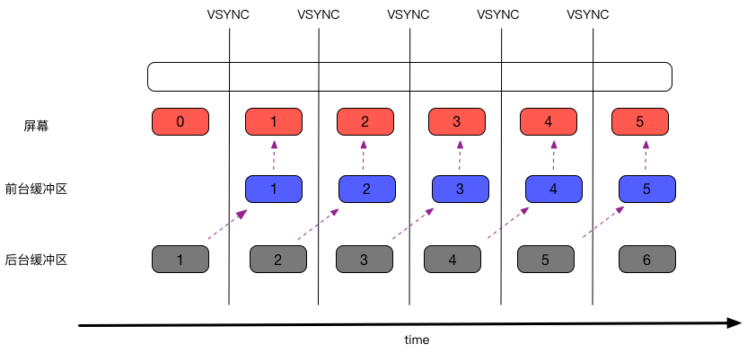
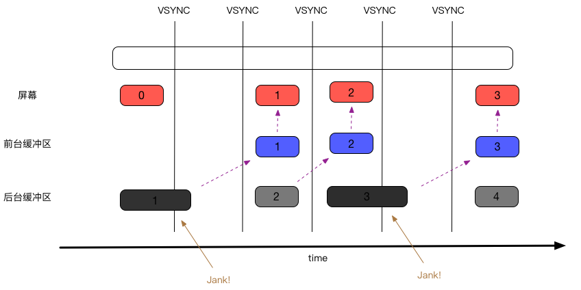
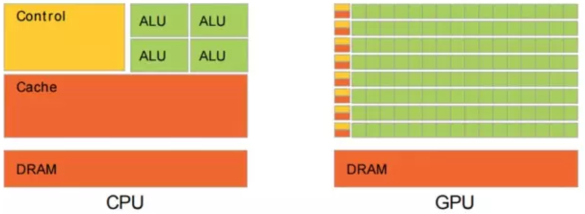
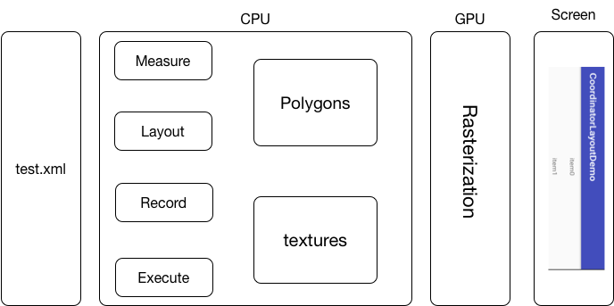
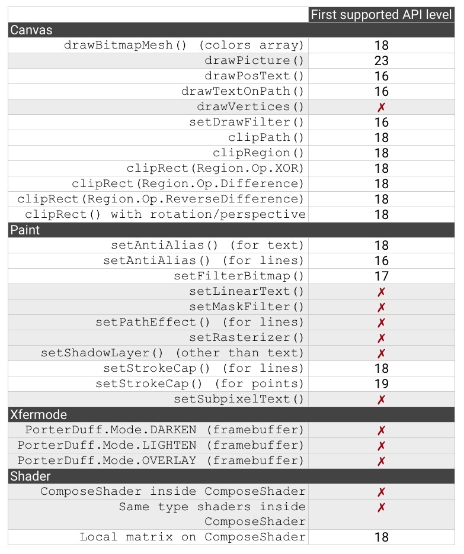

# 屏幕刷新的深度分析

屏幕的刷新涉及到2个方面的概念：

* **帧速率**：指的是设备每秒能绘制多少帧，当然这个值越高越好。目前安卓设备的标准要求是60FPS。
* **刷新率**：指的是设备的屏幕每秒中更新的次数，即所谓的赫兹。目前安卓设备这个值是60Hz。

**刷新率是硬件值，一般在设备出厂时就已经固定不可变；帧速率在出厂时也是固定的，但是在程序开发中，UI上的布局等因素会影响这个值，一般是拉低这个值。两个值之间没直接的关联关系，但是他们共同影响着屏幕的刷新。**

## 垂直同步（VSYNC）

垂直同步是在API 16引入的概念，它的出现是**为了解决屏幕同时出现多帧的数据，即相邻的帧部分的被同时绘制在了屏幕上，导致的效果是屏幕被撕裂。**这个跟我们看电视，视频信号传输不畅类似。

出现这个问题的原因是，**帧的数据源只有一个缓冲区，屏幕的绘制都是从这个缓冲区中读取数据帧。当相邻的数据帧的上一帧没有绘制完毕，又要开始绘制下一帧时，这样这个缓冲区里其实不是单帧的数据，而是多个帧的混杂数据，这样绘制时就出现了混乱。**而本质的原因是CPU和GPU速率上的不一致。

> 解决的方案

采用双缓冲区，即后台缓冲区和前台缓冲区。也就解决了CPU和GPU速率上不同步的问题，后台处理完了，才交给前台刷新。他们的关系是这样的：

* 后台缓冲区和前台缓冲区大小是一样的
* 后台缓冲区保存着
* 后台缓冲区不参与响应屏幕的绘制
* 绘制的数据必须来自于前台缓冲区，而前台缓冲区必须来自于后台缓冲区

这里有个问题，**就是数据帧从后台复制到前台时，需要保证屏幕不刷新，而这就是垂直同步。**

下面我们来分析下垂直同步、后台缓冲区、前台缓冲区的操作：

### situation 1：帧速率大于等于刷新率

可以看出整个的绘制时相当的流畅，屏幕没有出现延迟。

### situation 2：帧速率小于刷新率

这个时候，由于后台处理（一般是CPU和GPU的处理）不够快，导致不能在每次VSYNC中断的时候都能提供完整的数据帧，而不完整的数据帧是无法给到前台缓冲区的，所以无法刷新屏幕。

这样，整个屏幕实际有效的刷新帧数，即帧速率就下降了，这就是页面的卡顿。所以，虽然不会出现相邻帧混合在一起，但是会出现卡顿。

## 硬件加速深度分析

硬件加速最简单的理解就是讲CPU的工作由GPU去做。硬件加速的出现是在API 11，由于设备屏幕越来越大，单位尺寸上的像素密度也在增加，对于CPU，很难再去满足UI性能上需求，所以只能转向GPU。

**硬件加速从API 14开始默认开启**

> 为什么要给GPU？

两个方面的触发点：

* 绘制过程经常需要进行逻辑较简单、但数据量庞大的浮点运算。特别是动画绘制。
* GPU天生更适合计算
 
 * CPU有更多的控制器，而ALU较少；GPU正好反之。

> 绘制的提升
 
硬件加速不光只是利用了GPU的计算特性，它也做了绘制上的优化。

主要是2个步操作：

* 在CPU阶段，负责Measure、Layout、Execute，即负责将XML布局文件装换成多边形（polygons）和纹理（textures）。
* 然后进入到GPU阶段，这里是个OpenGL的操作，栅格化（Rasterization）

**系统渲染的原理**

为了能更加清晰的理解整个绘制上的优化，我们需要知道渲染的过程中发生了些什么。

**无硬件加速（基于软件）的绘制**

* **Invalidation**：当视图的层级发生变化，或者只是View的属性发生变化，`View.invalidate()`就会被调用，该方法会传播到整个视图层级，使得整个层级发生重绘。
* **Redrawing**：绘制整个的视图层级

这个时候，所有操作都是由CPU处理的，views被转换成屏幕上实际的像素（就是要直接绘制到屏幕上的信息），它是由Bitmap来承载的。当进行invalidate()时，为了得到正确的屏幕上实际的像素数据，将不得不重新绘制整个屏幕。

**硬件加速的绘制**

*  **Invalidation**：这一步逻辑不变，还是触发`View.invalidate()`
*  **Storing**：存储视图信息
*  **Redrawing**：利用上面存储下来的绘图进行更新操作

为啥可以做到这样的性能上的提升呢？这其实得益于GPU的数据转换和存储，views通过GPU转换并被保存了起来，通过DisplayList来承载，这时的数据还是抽象的，并不是最后的实际像素点，并且他们是相互独立的，这样就可以只绘制变化的view，对于其他的views则保持原样不变。

> * DisplayList：DisplayList是一个基本绘制元素，包含元素原始属性（位置、尺寸、角度、透明度等）。信息传递流程：Canvas(Java API) —> OpenGL(C/C++ Lib) —> 驱动程序 —> GPU。
> * RenderNode：一个RenderNode包含若干个DisplayList，通常一个RenderNode对应一个View，包含View自身及其子View的所有DisplayList。

### 图层

图层的好处是可以被重复的使用。

图层的提供是从API 11开始的，可以通过`View.setLayerType()`方法来设置图层的类型，具体的类型有：

* `LAYER_TYPE_NONE`：缺省值。指示该view不需要使用图层，正常的渲染view，view不能被存储起来，无法重复利用。
* `LAYER_TYPE_SOFTWARE`：指示view使用software图层，软图层是由Bitmap技术所支持，并且view的渲染是通过**Android's software rendering pipeline**，即时硬件加速开启的状态。它的使用场景有：
 * 当没有开启硬件加速的时候，作为硬件图层的替代。
 * 当硬件加速开启时，软图层可以作为不支持**Android's hardware rendering pipeline**的兼容措施
 * 软图层还能将复杂的视图结构缓存到纹理（texture）里，并且减少绘制操作的复杂性。例如：对视图进行translation的动画，软图层可以做到只对视图进行一次的渲染即可
 * **IMPORTANT：软图层在视图刷新很频繁的情况下不建议使用，因为每次的更新会重新渲染软图层，这将明显拉低效率。**
* `LAYER_TYPE_HARDWARE`：指示view使用硬件图层，硬件图层是由`hardware specific texture`技术（即Frame Buffer Objects）所支持，并且使得视图的渲染通过**Android's hardware rendering pipeline**，如果失败，则效果是和`LAYER_TYPE_SOFTWARE`一样。

> 图层的利用

图层可以被保存起来，以供以后使用。具体的操作：

1. Canvas.saveLayer()
2. Canvas.restore()

> 图层和属性动画的关系

复杂的view进行动画操作时，通过设置硬件图层来渲染可以提高性能。如果在应用中运行一个动画，但是并没有得到你想要的平滑效果，可以考虑为动画的view开启硬件层。

下面的属性在改变时，不会影响整个视图层级：

* alpha
* x/y
* translationX/translationY
* scaleX/scaleY
* rotationX/rotationY
* pivotX/pivotY

### 硬件加速的限制

硬件加速由于GPU的特性，在硬件加速开启的情况下，某些操作是无效的：

### 硬件加速的坑

硬件加速是采用显存进行页面渲染（不是物理内存），频繁的显存操作，会导致各种现实问题，在低显存的手机上会直接闪退。虽然手机的显存越来越大，但是页面中大量的图片或复杂的CSS还是会在设备上出现白屏、花屏等问题。

解决的方法，主要是2个思路：

* 降低当前页面内存的占用
* 适当的关闭硬件加速

还有一些其他问题，如：

* 某些UI元素没有显示：可能是没有调用invalidate
* 某些UI元素没有更新：可能是没有调用invalidate
* 绘制不正确：可能使用了不支持硬件加速的操作， 需要关闭硬件加速或者绕过该操作
* 抛出异常：可能使用了不支持硬件加速的操作， 需要关闭硬件加速或者绕过该操作
